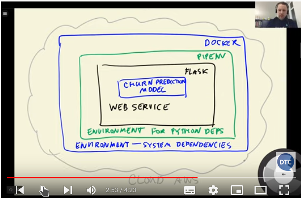

# 📘 ML Zoomcamp Week 5 – Model Deployment

## 🎯 Context and Aim

This module addresses the critical task of **deploying a machine learning model** into production. It uses the churn prediction model developed in previous weeks and demonstrates how to serve it through a web API using Flask, isolate it via virtual environments with Pipenv, encapsulate it using Docker, and finally deploy it to the cloud with AWS Elastic Beanstalk. The goal is to make the model accessible via HTTP requests from external systems, e.g., a marketing service that decides whether to offer customer promotions.

# 🧩️ Session-by-Session Breakdown

## 📺 5.1 – Introduction to Deployment

### ✅ Goal

Introduce the deployment workflow: saving a trained model and turning it into a web service.

### 🧠 Concept

Explain how a trained ML model can be used as a web API service in production environments.

### 🛠️ Tasks

* Load and finalize churn model from Week 3/4
* Outline deployment plan: Save → Serve → Isolate → Containerize → Deploy

### 💻 Microcode

```python
# model and dv are already trained
with open('model_C=1.bin', 'wb') as f_out:
    pickle.dump((dv, model), f_out)
```

---

## 📺 5.2 – Saving and Loading the Model

### ✅ Goal

Serialize the trained model and DictVectorizer using `pickle` for reuse.

### 🧠 Concept

Persist trained components as binary files to enable loading in another Python environment.

### 🛠️ Tasks

* Use `pickle.dump()` to save `(dv, model)`
* Use `pickle.load()` to reload them
* Convert notebook to a `.py` script for training automation

### 💻 Microcode

```python
# Save
with open('churn_model.bin', 'wb') as f_out:
    pickle.dump((dv, model), f_out)

# Load
with open('churn_model.bin', 'rb') as f_in:
    dv, model = pickle.load(f_in)
```

---

## 📺 5.3 – Web Services: Introduction to Flask

### ✅ Goal

Learn how to expose Python functions as web APIs.

### 🧠 Concept

Web services enable remote systems to interact with your model via HTTP requests (GET/POST).

### 🛠️ Tasks

* Install and import Flask
* Create `app = Flask(__name__)`
* Define a route (`@app.route()`)

### 💻 Microcode

```python
from flask import Flask
app = Flask('ping')

@app.route('/ping', methods=['GET'])
def ping():
    return 'pong'

if __name__ == '__main__':
    app.run(debug=True, host='0.0.0.0', port=9696)
```

---

## 📺 5.4 – Serving the Churn Model with Flask

### ✅ Goal

Create an API endpoint that takes customer data and returns churn probability.

### 🧠 Concept

Define an endpoint `/predict` that takes POSTed JSON, transforms it, and applies the trained model.

### 🛠️ Tasks

* Load `churn_model.bin`
* Define POST route `/predict`
* Use `model.predict_proba()` to return churn score

### 💻 Microcode

```python
from flask import request, jsonify
with open('churn_model.bin', 'rb') as f_in:
    dv, model = pickle.load(f_in)

@app.route('/predict', methods=['POST'])
def predict():
    customer = request.get_json()
    X = dv.transform([customer])
    y_pred = model.predict_proba(X)[0, 1]
    churn = y_pred >= 0.5
    return jsonify({'churn_probability': float(y_pred), 'churn': bool(churn)})
```

---

## 📺 5.5 – Virtual Environments with Pipenv

### ✅ Goal

Isolate Python dependencies to avoid conflicts between projects.

### 🧠 Concept

Use `pipenv` to create self-contained environments with precise dependency control.

check si pip is intalled globay
```which pip3
if not 
sudo apt install python3-pip
```
then install `sudo apt install pipx`, which allow pipenv to be installer globally\
🔁 Restart your terminal or run:

```
source ~/.bashrc  # or ~/.zshrc if you're using zsh

```
### 🛠️ Tasks

* Install pipenv: `pip install pipenv`
* Install dependencies: `pipenv install flask scikit-learn`

 in dev mode in a terminal at /path where is A1a_flask_churn_load_startwebservice.py
    python3 A1a_flask_churn_load_startwebservice.py
 run in deploy mode ( interminal but with the correct venv associated ):
     gunicorn --bind 0.0.0.0:9696 A1a_flask_churn_load_startwebservice:app
### 💻 Microcode

```bash
pipenv install flask scikit-learn gunicorn
pipenv shell
python predict.py  # inside virtual env
```

---

## 📺 5.6 – Docker: Full Environment Isolation

### ✅ Goal

Containerize the model service to make it portable and OS-independent.

### 🧠 Concept

Docker containers allow packaging app + dependencies + system-level libs into a single image.

### 🛠️ Tasks

* Create Dockerfile with base image and copy code
* Install dependencies from Pipenv files
* Add `.dockerignore` to exclude unnecessary files
* Add healthcheck for service monitoring
* Optionally define a non-root user for security

### 💻 Microcode
### ✅ To correctly install Docker on Debian:

Run the following **official setup** from Docker:

### 1. **Uninstall the incorrect one**

```bash
sudo apt-get remove docker docker.io docker-doc docker-compose docker-compose-v2 \
                     podman-docker containerd runc wmdocker
```

---

### 2. **Install Docker Engine from Docker’s repo**

```bash
sudo apt-get update
sudo apt-get install \
    ca-certificates \
    curl \
    gnupg \
    lsb-release
```

Then add Docker’s GPG key:

```bash
sudo mkdir -p /etc/apt/keyrings
curl -fsSL https://download.docker.com/linux/debian/gpg | \
    sudo gpg --dearmor -o /etc/apt/keyrings/docker.gpg
```

Then add the Docker repo:

```bash
echo \
  "deb [arch=$(dpkg --print-architecture) \
  signed-by=/etc/apt/keyrings/docker.gpg] \
  https://download.docker.com/linux/debian \
  $(lsb_release -cs) stable" | \
  sudo tee /etc/apt/sources.list.d/docker.list > /dev/null
```

---

### 3. **Install Docker Engine**

```bash
sudo apt-get update
sudo apt-get install docker-ce docker-ce-cli containerd.io docker-buildx-plugin docker-compose-plugin
```

---

### 4. **Verify Docker is working**

```bash
sudo docker run hello-world
```

If you want to avoid `sudo` every time:

```bash
sudo usermod -aG docker $USER
newgrp docker
```

---
To use docker 
``
sudo docker run -it python:3.11-slim
``
it will start the docker env with the desired python


```dockerfile
FROM python:3.10-slim

WORKDIR /app

COPY Pipfile Pipfile.lock ./
RUN pip install pipenv && pipenv install --system --deploy

COPY . .

# Optional security hardening
RUN useradd -m appuser
USER appuser

EXPOSE 9696

HEALTHCHECK --interval=30s --timeout=5s --start-period=5s --retries=3 \
  CMD curl -f http://localhost:9696/ping || exit 1

CMD ["gunicorn", "predict:app", "--bind", "0.0.0.0:9696"]
```
The flags `--deploy` and `--system` make sure that we install the dependencies directly inside the Docker container without creating an additional virtual environment (which `pipenv` does by default). 

If we don't put the last line `ENTRYPOINT`, we will be in a python shell.
Note that for the entrypoint, we put our commands in double quotes.

After creating the Dockerfile, we need to build it:

```bash
docker build -t churn-prediction .
```
this create an image ready to be deployed afterward

**Run**:

```bash
docker run -it -p 9696:9696 churn-prediction
```
run the image and associate the port

Flag explanations: 

- `-t`: is used for specifying the tag name "churn-prediction".
- `-it`: in order for Docker to allow us access to the terminal.
- `--rm`: allows us to remove the image from the system after we're done.  
- `-p`: to map the 9696 port of the Docker to 9696 port of our machine. (first 9696 is the port number of our machine and the last one is Docker container port.)
- `--entrypoint=bash`: After running Docker, we will now be able to communicate with the container using bash (as you would normally do with the Terminal). Default is `python`.


---

## 📺 5.7 – Deploy to the Cloud AWS Elastic Beanstalk (Optional)

### ✅ Goal

Deploy Docker container to AWS Elastic Beanstalk.

### 🧠 Concept

Elastic Beanstalk abstracts infrastructure management, offering scaling and deployment tools.

### 🛠️ Tasks

* Install EB CLI: `pipenv install awsebcli --dev`
* Init project: `eb init -p docker`
* Run locally: `eb local run`
* Deploy: `eb create churn-serving`

### 💻 Microcode

```bash
eb init -p docker churn-serving --region eu-west-1
eb create churn-serving-env
eb open  # view deployed endpoint
```

---

> ✅ Summary: From model serialization to containerization and cloud deployment, this week provides the foundational pipeline for **serving ML models** in production using Flask, Pipenv, Docker, and AWS.

Next up: Decision Trees ⬇️
