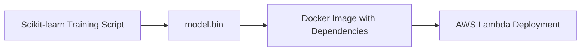
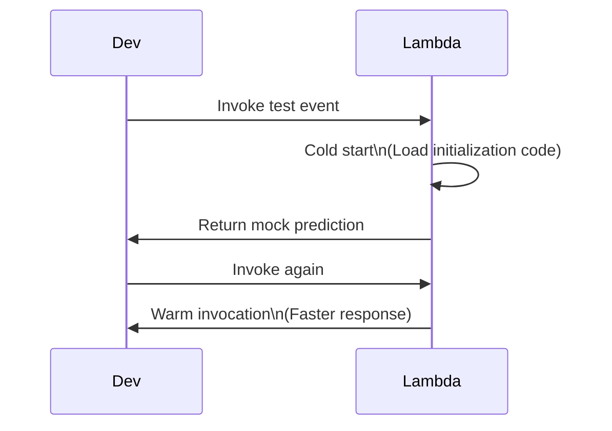
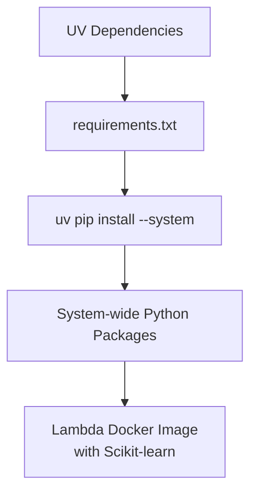
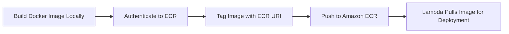
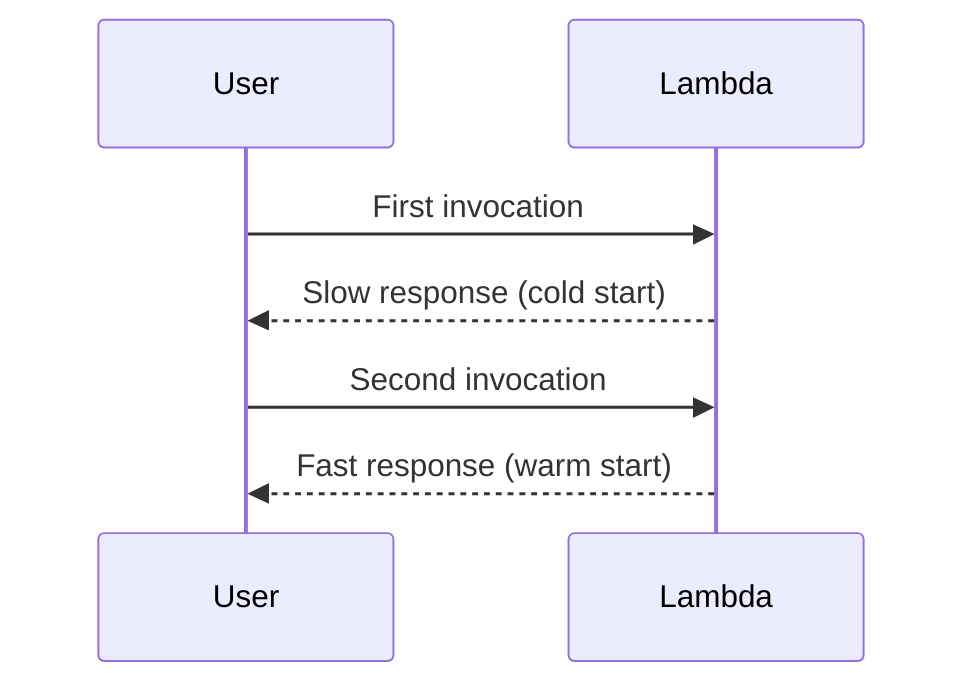
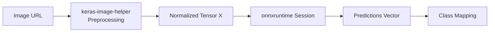
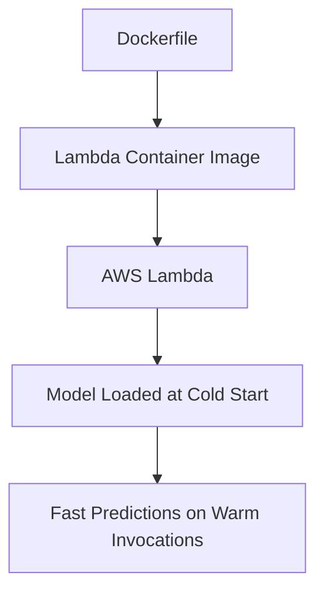
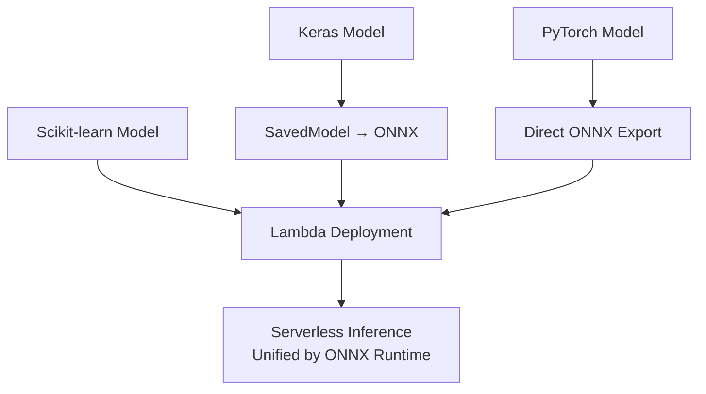

# 📺 0:00 – Workshop Introduction, AWS Lambda Requirements & ML Zoomcamp Updates

### ✅ Learning Objectives (30–60 words)

After this session, students should be able to:

* Understand the purpose of the workshop within the ML Zoomcamp updates.
* Identify all required prerequisites (AWS account, AWS CLI, Docker).
* Explain why TensorFlow Lite is no longer suitable for AWS Lambda.
* Describe the workshop roadmap: Scikit-learn, ONNX, Keras, PyTorch deployments.

### 🧠 Core Concepts & Theory (30–150 words)

This introduction sets the foundation for the workshop. AWS Lambda is presented as a serverless execution platform that bills only for compute time actually used, making it efficient for sporadic workloads. The instructor explains that the original Serverless Deep Learning module relied on TensorFlow Lite, but maintaining TF Lite for AWS Lambda has become impractical due to the need for custom compilation targeting Amazon Linux.
ONNX emerges as a universal model format enabling cross-framework inference (Keras, PyTorch, Scikit-learn). It decouples training frameworks from deployment runtimes, enabling lightweight, production-ready inference via `onnxruntime`.
The session outlines the plan: deploying a Scikit-learn model via Lambda, converting Keras models to ONNX, and exporting PyTorch models to ONNX for fast serverless deployment.

### 📋 Key Points & Takeaways

**Main Themes (3–5 points)**

* Explanation of the workshop goals and module updates.
* Issues with TensorFlow Lite compatibility on AWS Lambda.
* Importance of ONNX as the new standard for model deployment.
* Required tools: Docker, AWS CLI, AWS account.

**Critical Details (4–6 points)**

* ML Zoomcamp originally recorded four years ago → needs modernization.
* Lambda charges only for invocation runtime.
* TF Lite binaries must be compiled for Amazon Linux → now highly difficult.
* ONNX supports unified export from many ML frameworks.
* Workshop covers Scikit-learn, Keras→ONNX, and PyTorch→ONNX pipelines.

### 💡 Practical Examples & Applications

* Deploying a Scikit-learn churn prediction model previously built in another workshop.
* Converting a Keras clothing-classifier model to ONNX for Lambda inference.
* Exporting a PyTorch MobileNet model directly to ONNX for lightweight deployment.

### 📊 Concept Diagram

```mermaid
flowchart LR
A[Various ML Models\n(Scikit-learn, Keras, PyTorch)] --> B[Convert to ONNX]
B --> C[Docker Lambda Image]
C --> D[AWS Lambda\nServerless Deployment]
D --> E[Production Predictions]
```

### ❓ Review Questions

**Q1: Why is TensorFlow Lite no longer recommended for AWS Lambda?**

<details><summary>💡 Answer</summary>
Because TF Lite requires custom compilation for Amazon Linux, and maintaining compatible binaries for modern TensorFlow versions has become extremely difficult and unreliable.
</details>

**Q2: What key advantage of AWS Lambda is highlighted in this section?**

<details><summary>💡 Answer</summary>
Lambda only charges for actual execution time—no cost when the function is idle.
</details>

**Q3: What is one major goal of the workshop regarding PyTorch models?**

<details><summary>💡 Answer</summary>
To demonstrate how to export PyTorch models directly to ONNX and deploy them in AWS Lambda using Docker containers.
</details>

---

# ## 📺 1:43 – Why ONNX Replaces TensorFlow Lite & Preparing Scikit-learn Deployment

### ✅ Learning Objectives

After completing this section, students should be able to:

* Explain the limitations of TensorFlow Lite in serverless environments.
* Understand why ONNX is becoming the standard for ML model deployment.
* Prepare a Scikit-learn model for Lambda deployment.
* Execute the churn training script and produce the `model.bin` artifact.

### 🧠 Core Concepts & Theory

This section clarifies the transition from TensorFlow Lite to ONNX for serverless ML. TF Lite historically worked well but now requires difficult compilation steps to produce Amazon Linux–compatible binaries, making it unreliable for Lambda.
ONNX provides a framework-agnostic intermediate representation that enables lightweight inference with `onnxruntime`. This reduces dependency size and simplifies deployment across heterogeneous environments.
For Scikit-learn models, no ONNX conversion is needed in this workshop: they are pickled and loaded inside a controlled Docker environment. The instructor shows how to recreate the churn model via a training script, preparing the serialized artifact for later deployment.

### 📋 Key Points & Takeaways

**Main Themes**

* Practical challenges with TensorFlow Lite for Amazon Linux.
* ONNX as a unified deployment format for multiple frameworks.
* Rebuilding the churn model using Scikit-learn.
* Preparing the serialized model for Lambda.

**Critical Details**

* Conversion path for deep learning models: Keras → SavedModel → ONNX.
* Scikit-learn is simpler: direct pickle loading inside Docker.
* Dependencies are installed using the UV tool.
* Training script produces `model.bin`, the deployable artifact.
* Local testing validates model correctness before Dockerization.

### 💡 Practical Examples & Applications

* Running `uv run python train.py` to generate `model.bin`.
* Using the churn dataset model as the first Lambda deployment demo.
* Setting up the folder structure for Scikit-learn model packaging.

### 📊 Concept Diagram



### ❓ Review Questions

**Q1: What makes TensorFlow Lite problematic on AWS Lambda?**

<details><summary>💡 Answer</summary>
It requires manually compiled binaries for Amazon Linux, and modern TensorFlow versions make this process increasingly difficult and fragile.
</details>

**Q2: What tool is used to manage dependencies and run the Scikit-learn training script?**

<details><summary>💡 Answer</summary>
The UV tool (`uv init`, `uv add`, `uv run`).
</details>

**Q3: What is the purpose of the `model.bin` file?**

<details><summary>💡 Answer</summary>
It contains the serialized Scikit-learn model (via pickle) that will be embedded into the Lambda Docker image.
</details>


Great — I will now continue with **sections 3 and 4**, following **your structure and rules exactly**, in **English**, based strictly on the transcript.

---

# ## 📺 6:00 – Preparing the Scikit-learn Model for Deployment (Churn Prediction Example)

### ✅ Learning Objectives

By the end of this section, students should be able to:

* Execute a Scikit-learn training script to generate a serialized model.
* Understand how to structure a project with UV (dependencies + training code).
* Produce the `model.bin` artifact required for Lambda deployment.
* Validate that the model runs locally before building a Docker image.

### 🧠 Core Concepts & Theory

This section transitions from theory to hands-on preparation. The instructor explains that the Scikit-learn churn prediction model was previously developed in another workshop and will now be reused for serverless deployment.
The focus is on reproducibility: using UV to initialize a clean environment, install dependencies (`scikit-learn`, `pandas`), and run the training script. The output of this workflow is a pickled pipeline (`model.bin`). This artifact contains preprocessing + logistic regression inference logic and is later embedded in a Dockerized Lambda function.
The approach highlights a key principle in serverless ML: **models must be packaged with their exact dependencies**, since Lambda environments are isolated and do not contain Scikit-learn by default.

### 📋 Key Points & Takeaways

**Main Themes**

* Running a Scikit-learn training script to regenerate the churn model.
* Using UV for dependency management and reproducibility.
* Producing a serialized binary model file (`model.bin`).
* Preparing artifacts for container-based Lambda deployment.

**Critical Details**

* A dedicated folder (e.g., `sklearn/train`) stores the training script.
* `uv init` creates the project structure; `uv add` installs dependencies.
* Running `uv run python train.py` executes training and saves the model.
* The resulting `model.bin` must be moved to the deployment root.
* This step ensures the model is self-contained before Dockerization.

### 💡 Practical Examples & Applications

* Using the exact churn prediction pipeline from Module 5 (logistic regression).
* Producing a lightweight and easily serializable Scikit-learn model for serverless.
* Establishing a workflow that mirrors real-world ML engineering practices.

### 📊 Concept Diagram

```mermaid
flowchart LR
A[Training Script\n(train.py)] --> B[UV Environment]
B --> C[Model Trained]
C --> D[model.bin Saved]
D --> E[Ready for Lambda Docker Packaging]
```

### ❓ Review Questions

**Q1: Why do we regenerate the churn model instead of reusing an old version?**

<details><summary>💡 Answer</summary>
To ensure reproducibility and compatibility with current library versions, and to generate a clean `model.bin` ready for packaging in the Lambda container.
</details>

**Q2: What does UV provide in this workflow?**

<details><summary>💡 Answer</summary>
UV manages dependencies, creates an isolated project setup, and runs the Python training script in a controlled environment.
</details>

**Q3: What is the purpose of `model.bin`?**

<details><summary>💡 Answer</summary>
It contains the serialized Scikit-learn pipeline that will be loaded inside the Lambda Docker image to perform predictions.
</details>

---

# ## 📺 11:34 – Creating and Testing the AWS Lambda Function (Pay-Per-Execution Advantage)

### ✅ Learning Objectives

After this section, students should be able to:

* Create a basic AWS Lambda function from scratch via the AWS Console.
* Understand how to structure Lambda handler code.
* Execute test events to validate the function.
* Explain Lambda’s pay-per-execution cost model (cold starts vs warm states).

### 🧠 Core Concepts & Theory

This section introduces the practical use of AWS Lambda, emphasizing its **serverless execution model**. Lambda functions run only when invoked and incur cost solely for compute time used. Unlike traditional servers, no continuous instance runs in the background.
Students learn how Lambda executes code in two phases:

1. **Cold start phase** — initialization code runs once when the function container is first created.
2. **Invocation phase** — the handler runs for each request.

The instructor demonstrates uploading placeholder logic that simulates a prediction function and notes that real dependencies (Scikit-learn, NumPy) cannot be installed directly in the Lambda console. This limitation motivates the upcoming use of Docker-based Lambda deployment.

### 📋 Key Points & Takeaways

**Main Themes**

* Creating a Lambda function from the AWS Console.
* Writing and editing Lambda handler code.
* Using test events to verify responses.
* Introduction to the Lambda execution lifecycle.

**Critical Details**

* The handler is structured as `lambda_function.lambda_handler`.
* Test events allow local validation inside the AWS Console.
* Cold starts occur when AWS provisions a new container for execution.
* Subsequent invocations benefit from warm execution and reuse in-memory state.
* Dependencies like Scikit-learn cannot be installed directly — requiring Docker packaging.

### 💡 Practical Examples & Applications

* A mock `predict_single()` function returns a fixed probability to simulate inference.
* A sample customer JSON test event reproduces the format of the churn dataset.
* Students observe the difference between editing code inline vs packaging externally.

### 📊 Concept Diagram



### ❓ Review Questions

**Q1: What is the role of the Lambda handler?**

<details><summary>💡 Answer</summary>
It is the function invoked on every request and contains the logic to process the event and return a response.
</details>

**Q2: Why can’t we install Scikit-learn directly in the AWS Lambda console?**

<details><summary>💡 Answer</summary>
Lambda’s inline editor cannot install external binary dependencies; these must be packaged via Docker or Lambda layers.
</details>

**Q3: What is the key cost benefit of AWS Lambda discussed here?**

<details><summary>💡 Answer</summary>
Lambda charges only for execution time — there is no cost when the function is idle, unlike traditional servers.
</details>


# ## 📺 17:36 – Invoking Lambda and Handling Dependency Challenges

### ✅ Learning Objectives

By the end of this section, students should be able to:

* Invoke a Lambda function programmatically using `boto3`.
* Understand why importing Scikit-learn inside Lambda fails without packaging.
* Explain the necessity of bundling dependencies in a Docker image.
* Diagnose import errors and differentiate between environment vs. code issues.

### 🧠 Core Concepts & Theory

This section highlights a key challenge in serverless ML deployment: **Lambda does not provide scientific Python libraries out of the box**. Attempting to unpickle a Scikit-learn model inside Lambda without including the proper environment leads to import errors (“No module named 'sklearn'”).
The instructor demonstrates how to invoke Lambda via a Python script using `boto3.client("lambda")`, illustrating real-world integration patterns.
The lesson: serverless environments require **complete dependency isolation**. Any library used for model loading or inference must be embedded inside the deployment artifact. Because Lambda’s built-in runtime is minimal, students must package Scikit-learn via Docker to ensure consistency and reproducibility.

### 📋 Key Points & Takeaways

**Main Themes**

* Programmatic Lambda invocation using Python.
* Understanding Lambda execution failures caused by missing dependencies.
* Why Docker is required for ML models on Lambda.
* Preparing for container-based deployment.

**Critical Details**

* A simple Python script can invoke Lambda via `invoke(FunctionName=...)`.
* Lambda tries to unpickle `model.bin` → fails because Scikit-learn isn't installed.
* Lambda environments cannot install binary dependencies on the fly.
* A Docker image will provide a fully controlled execution environment.

### 💡 Practical Examples & Applications

* Example invocation script using `boto3` and JSON payloads.
* Observing the exact runtime error (`ModuleNotFoundError: No module named 'sklearn'`).
* Transitioning from Lambda inline code to Docker-based deployment.

### 📊 Concept Diagram

```mermaid
flowchart LR
A[Lambda Invocation\nvia boto3] --> B[Lambda Runtime]
B --> C{Imports succeed?}
C -- No sklearn --> D[Import Error\n(No module named 'sklearn')]
C -- Yes --> E[Prediction Processed]
```

### ❓ Review Questions

**Q1: Why does unpickling the Scikit-learn model fail in Lambda?**

<details><summary>💡 Answer</summary>
Because the Lambda environment does not include Scikit-learn, so the pickled object cannot be deserialized.
</details>

**Q2: Which Python library is used to invoke Lambda programmatically?**

<details><summary>💡 Answer</summary>
`boto3`, specifically the Lambda client (`boto3.client("lambda")`).
</details>

**Q3: What is the key reason ML practitioners must package dependencies with Docker?**

<details><summary>💡 Answer</summary>
Docker provides a self-contained environment with all required libraries, avoiding the limitations of Lambda’s minimal runtime.
</details>

---

# ## 📺 21:12 – Solving Dependencies with Docker AWS Base Images & the UV Tool

### ✅ Learning Objectives

After this section, students should be able to:

* Build a Lambda-compatible Docker image using Amazon’s official base images.
* Package dependencies (like Scikit-learn) inside a container for Lambda.
* Use UV to install dependencies into the system Python layer (not a virtual env).
* Understand why Lambda cannot use virtual environments inside containers.

### 🧠 Core Concepts & Theory

This section explains how to correctly package dependencies for Lambda using **AWS Lambda base images**. These images contain the Lambda runtime and are the recommended foundation for deploying container-based functions.
When using UV, dependencies are installed inside a virtual environment by default. However, Lambda **does not activate virtual environments**, meaning the installed packages cannot be found at runtime.
Students learn to export dependencies (`uv export`) and install them system-wide using `uv pip install --system -r requirements.txt`. This embeds Scikit-learn, NumPy, and other required packages inside the Docker image.
The instructor also introduces Dockerfile conventions such as copying source files, copying the model, installing UV, and defining the Lambda entrypoint.

### 📋 Key Points & Takeaways

**Main Themes**

* How to construct a Lambda-ready Dockerfile.
* Why Lambda does not use virtual environments inside containers.
* Using UV to efficiently manage and export dependencies.
* Installing dependencies system-wide to ensure correct resolution.

**Critical Details**

* Base image used: `public.ecr.aws/lambda/python:3.13` (or the version available).
* Must copy `uv` binary into `/bin` to reduce image size.
* Must run `uv pip install --system` to install dependencies globally.
* Docker CMD must reference `"lambda_function.lambda_handler"`.

### 💡 Practical Examples & Applications

* Dockerfile snippet:

  * `FROM public.ecr.aws/lambda/python:3.13`
  * `COPY model.bin /var/task/`
  * `COPY lambda_function.py /var/task/`
  * `CMD ["lambda_function.lambda_handler"]`
* Efficient installation using UV reduces container size and speeds up deployment.

### 📊 Concept Diagram



### ❓ Review Questions

**Q1: Why can’t Lambda rely on a virtual environment created by UV inside the container?**

<details><summary>💡 Answer</summary>
Lambda does not activate virtual environments during execution, so only system-level packages are visible.
</details>

**Q2: What is the purpose of `uv export`?**

<details><summary>💡 Answer</summary>
It exports project dependencies into a `requirements.txt` file that can be installed system-wide using UV or pip.
</details>

**Q3: Why do we copy the UV binary directly into `/bin`?**

<details><summary>💡 Answer</summary>
To avoid installing the full UV toolchain, reducing image size and speeding up builds.
</details>


---

# ## 📺 32:49 – Building and Publishing the Optimized Docker Image to AWS ECR

### ✅ Learning Objectives

After this section, students should be able to:

* Build a Docker image for a Lambda function using UV-optimized dependency installation.
* Authenticate to Amazon ECR and push an image to a dedicated repository.
* Understand the tagging workflow linking local images to remote ECR URLs.
* Prepare the image for deployment inside AWS Lambda.

### 🧠 Core Concepts & Theory

This section covers the full workflow for packaging and distributing a Lambda-compatible Docker image. Students learn that Lambda can directly consume container images stored in **Amazon Elastic Container Registry (ECR)**.
To deploy, they must:

1. Build the image locally (using UV-installed dependencies + optimized binary copy).
2. Create an ECR repository (manually or via CLI).
3. Authenticate Docker to AWS using `aws ecr get-login-password`.
4. Tag the local image with the ECR URI.
5. Push the image to ECR.

This workflow ensures reproducibility and isolates all dependencies (Scikit-learn, NumPy, the pickled model, Python scripts) inside a controlled environment. Students also observe first-hand that image size influences upload speed and Lambda cold-start times.

### 📋 Key Points & Takeaways

**Main Themes**

* Full Lambda container publishing workflow using ECR.
* Image tagging and pushing procedures.
* Role of the ECR repository in serverless deployment.
* Importance of minimizing image size.

**Critical Details**

* The ECR image URL includes the AWS account ID + region + repo name.
* Authentication is performed via:

  ```
  aws ecr get-login-password | docker login --username AWS --password-stdin <ECR_URL>
  ```
* Tagging workflow:

  ```
  docker tag local_image:latest <ECR_URL>:v1
  ```
* Pushing workflow:

  ```
  docker push <ECR_URL>:v1
  ```
* Final image size displayed in ECR (~207 MB in the transcript).

### 💡 Practical Examples & Applications

* A `publish.sh` script is created to automate:

  * building,
  * authenticating,
  * tagging,
  * pushing to ECR.
* Image is later selected directly inside the Lambda console when creating a container-based function.

### 📊 Concept Diagram



### ❓ Review Questions

**Q1: Why do we need to tag the local image before pushing to ECR?**

<details><summary>💡 Answer</summary>
Because Docker requires the remote ECR URI tag to know where to upload the image.
</details>

**Q2: What command is used to authenticate Docker to AWS ECR?**

<details><summary>💡 Answer</summary>
`aws ecr get-login-password | docker login --username AWS --password-stdin <ECR_URL>`
</details>

**Q3: Why is minimizing Docker image size important for Lambda?**

<details><summary>💡 Answer</summary>
Smaller images reduce upload time, storage costs, and Lambda cold-start latency.
</details>

---

# ## 📺 41:31 – Final Lambda Configuration & Q&A (SageMaker vs Lambda, Cold Starts)

### ✅ Learning Objectives

After this session, students should be able to:

* Configure a Lambda function to use a Docker image from ECR.
* Diagnose and resolve cold-start timeouts by adjusting memory and timeout settings.
* Understand the difference between Lambda and SageMaker for model deployment.
* Explain how Lambda manages warm vs cold executions.

### 🧠 Core Concepts & Theory

This section demonstrates the creation of a container-based Lambda function using the newly pushed ECR image. Students observe the typical cold-start behavior: the first invocation is much slower because Lambda must pull the image and initialize the runtime.
Configuration details such as function timeout and memory allocation significantly influence performance. Increasing timeout (e.g., to 30 seconds) prevents premature failures.
The instructor answers common deployment questions:

* **SageMaker vs Lambda:** SageMaker is more expensive and suited for larger, continuously served models; Lambda is cheaper for sporadic workloads.
* **Model loading behavior:** Models load only during the cold start. Warm invocations reuse in-memory state, making consecutive calls fast.
* **Large model sizes:** Even a 2 GB model loads once per warm cycle, not per invocation.

### 📋 Key Points & Takeaways

**Main Themes**

* Creating a Lambda function from an ECR container image.
* Cold-start vs warm-start behavior.
* Parameter tuning (timeout, memory).
* Cost and complexity comparison: SageMaker vs Lambda.

**Critical Details**

* First invocation timed out because Lambda was pulling the image.
* Increasing timeout + memory resolved the issue.
* Warm invocations became instant (~milliseconds).
* Lambda retains the model in memory until the container is recycled.
* SageMaker requires both a model endpoint and Lambda caller → greater cost/complexity.

### 💡 Practical Examples & Applications

* Testing Lambda in the console using a real customer payload.
* Switching to a local Python script (`invoke.py`) using `boto3` for end-to-end testing.
* Observing different timing profiles:

  * Cold start: ~3 seconds
  * Subsequent calls: nearly instantaneous

### 📊 Concept Diagram



### ❓ Review Questions

**Q1: Why did the instructor increase the Lambda timeout from the default value?**

<details><summary>💡 Answer</summary>
Because the initial cold start required time to pull the container image and load the model, causing the default timeout to be exceeded.
</details>

**Q2: In what situation is SageMaker less suitable than Lambda?**

<details><summary>💡 Answer</summary>
For workloads with low or sporadic traffic, where Lambda’s pay-per-execution model is far cheaper than maintaining a continuously running SageMaker endpoint.
</details>

**Q3: Does a model reload on every Lambda call?**

<details><summary>💡 Answer</summary>
No. Model loading happens only during cold start. Warm invocations reuse the already loaded model in memory.
</details>


# ## 📺 43:44 – Why TensorFlow Lite Fails for Lambda & Why ONNX Becomes the Standard

### ✅ Learning Objectives

After this session, students should be able to:

* Explain why TensorFlow Lite is no longer practical for AWS Lambda deployments.
* Understand the ONNX model format as a cross-framework deployment standard.
* Describe the conversion pipeline from Keras/TensorFlow to ONNX.
* Recognize the benefits of using ONNX Runtime for serverless inference.

### 🧠 Core Concepts & Theory

This section provides a historical and technical explanation of why the serverless module originally used TensorFlow Lite—and why that approach is now obsolete.
TensorFlow Lite requires **custom compilation** to produce binaries compatible with Amazon Linux, the OS powering Lambda runtimes. While this was once feasible, modern TensorFlow versions have grown so large and complex that compiling TF Lite for Lambda has become impractical or impossible.
ONNX emerges as the solution: a framework-neutral representation of models supporting Keras, PyTorch, scikit-learn (via converters), and more. With ONNX, training and inference frameworks are decoupled. Using `onnxruntime`, deployment becomes lightweight, fast, and fully compatible with Lambda.

### 📋 Key Points & Takeaways

**Main Themes**

* Decline of TensorFlow Lite’s usability for Lambda.
* ONNX as a universal ML representation layer.
* Replacing heavy TF-lite inference with lightweight ONNX Runtime.
* Preparing for ONNX conversion in the workflow.

**Critical Details**

* TensorFlow Lite binaries must match Amazon Linux; official builds target Debian/Ubuntu → incompatibility.
* Compilation previously required large EC2 instances; now often fails outright.
* ONNX supports Keras, PyTorch, Caffe2, MXNet, and others.
* ONNX Runtime is much smaller than TensorFlow and ideal for Lambda containers.

### 💡 Practical Examples & Applications

* The instructor shows previously compiled TF Lite binaries that no longer work.
* Introduces the ONNX export path as the new default for updated ML Zoomcamp content.
* Sets up the pipeline for later conversion of a clothing-classification model.

### 📊 Concept Diagram

```mermaid
flowchart LR
A[TensorFlow/Keras Model] --> B[SavedModel Export]
B --> C[Convert to ONNX]
C --> D[ONNX Runtime\n(Lambda Compatible)]
D --> E[Serverless Inference]
```

### ❓ Review Questions

**Q1: Why are official TensorFlow Lite builds incompatible with Lambda?**

<details><summary>💡 Answer</summary>
They are compiled for Debian/Ubuntu, not for Amazon Linux, so Lambda cannot run them.
</details>

**Q2: What key advantage does ONNX offer over TensorFlow Lite?**

<details><summary>💡 Answer</summary>
ONNX enables framework-agnostic deployment and uses lightweight runtimes suitable for Lambda.
</details>

**Q3: Why does modern TensorFlow Lite compilation often fail?**

<details><summary>💡 Answer</summary>
Because TensorFlow has grown large and complex, making custom builds for Amazon Linux extremely difficult.
</details>

---

# ## 📺 52:53 – Converting Keras Models to ONNX in a Dedicated Docker Environment

### ✅ Learning Objectives

After this section, students should be able to:

* Convert a Keras model into TensorFlow’s SavedModel format.
* Use a Docker-based environment to convert SavedModel → ONNX safely.
* Understand why ONNX conversion should not be performed directly on the host machine.
* Generate a final `.onnx` model ready for Lambda deployment.

### 🧠 Core Concepts & Theory

This section walks through the **two-step Keras-to-ONNX conversion pipeline**:

1. Convert the Keras `.keras` or HDF5 model into a TensorFlow SavedModel directory.
2. Convert that SavedModel into ONNX using `tf2onnx`.

The instructor emphasizes isolation: attempting this conversion directly on a local machine can break TensorFlow installations because of conflicting dependencies. Using a **dedicated Docker image** ensures reproducibility and avoids dependency collisions.
Once converted, the ONNX model becomes framework-independent and ready for use with `onnxruntime` inside a Lambda container.

### 📋 Key Points & Takeaways

**Main Themes**

* Two-stage Keras → SavedModel → ONNX conversion process.
* Using Docker for stable and repeatable conversions.
* Avoiding dependency conflicts by isolating TensorFlow and tf2onnx.

**Critical Details**

* The instructor provides a pre-built Docker image containing TensorFlow + tf2onnx.
* Conversion command example:

  ```
  python -m tf2onnx.convert --saved-model model_tf --output model.onnx --opset 13
  ```
* ONNX opset 13 is recommended for broad compatibility.
* Output: a clean, portable `model.onnx` file.

### 💡 Practical Examples & Applications

* Model: a Keras Xception-based clothing classifier saved as `clothing-model-new.keras`.
* Script `convert_saved_model.py` created to export SavedModel.
* Docker `-v` volume mount used to access local files inside the container.
* Students observe warnings during conversion but a successful ONNX output.

### 📊 Concept Diagram

```mermaid
flowchart TD
A[Keras Model (.keras)] --> B[Export SavedModel]
B --> C[Docker Environment\nTensorFlow + tf2onnx]
C --> D[Convert to ONNX]
D --> E[Deployable ONNX Model]
```

### ❓ Review Questions

**Q1: Why is the ONNX conversion done inside Docker?**

<details><summary>💡 Answer</summary>
To avoid dependency conflicts or breaking local TensorFlow installations; Docker isolates all required tools.
</details>

**Q2: What are the two major steps in converting a Keras model to ONNX?**

<details><summary>💡 Answer</summary>
(1) Export the model to SavedModel, (2) convert SavedModel to ONNX using `tf2onnx`.
</details>

**Q3: Why was opset 13 chosen for conversion?**

<details><summary>💡 Answer</summary>
It provides broad compatibility and is commonly supported by ONNX Runtime.
</details>


# ## 📺 1:00:18 – Testing the ONNX Model Locally with `onnxruntime` and `keras-image-helper`

### ✅ Learning Objectives

After this session, students should be able to:

* Load and run inference on an ONNX model using `onnxruntime`.
* Preprocess images correctly using `keras-image-helper`.
* Extract ONNX input/output names and feed data into the model.
* Interpret the raw prediction scores and map them to class labels.

### 🧠 Core Concepts & Theory

This section demonstrates how to verify ONNX model correctness by running inference locally before deploying to Lambda.
`onnxruntime` is introduced as a lightweight, high-performance engine capable of executing models exported from Keras, TensorFlow, or PyTorch. The student learns that ONNX models require:

1. The **input tensor name** (e.g., `"input_1"`),
2. The **output tensor name** (e.g., `"predictions"`),
3. A properly-shaped and normalized input matrix.

A critical component is `keras-image-helper`, a small utility library that replicates the preprocessing logic of popular Keras architectures (e.g., Xception). This avoids installing the full TensorFlow library—ideal for serverless environments.

### 📋 Key Points & Takeaways

**Main Themes**

* Local inference testing with ONNX Runtime.
* Image preprocessing replicating Keras models but without TensorFlow.
* Feeding preprocessed tensors into `session.run()`.

**Critical Details**

* The image URL for testing: `http://bit.ly/mlbookcamp-pants`.
* Preprocessing uses:

  ```
  preprocessor = keras_image_helper.create_preprocessor("xception", target_size=(299, 299))
  X = preprocessor.from_url(url)
  ```
* ONNX inference:

  ```
  session.run([output_name], {input_name: X})
  ```
* Predictions must be converted to Python floats for JSON serialization.

### 💡 Practical Examples & Applications

* Running inference on a sample image of pants and confirming that "pants" receives the highest probability.
* Mapping output scores to a class list: `["dress", "hat", ... "pants"]`.

### 📊 Concept Diagram



### ❓ Review Questions

**Q1: Why is `keras-image-helper` used instead of TensorFlow for preprocessing?**

<details><summary>💡 Answer</summary>
Because it provides the same preprocessing logic as TensorFlow models without requiring the heavy TensorFlow dependency, making deployments lightweight and Lambda-friendly.
</details>

**Q2: What elements are required to run ONNX inference?**

<details><summary>💡 Answer</summary>
An ONNX `InferenceSession`, the model’s input name, the output name, and a correctly preprocessed input tensor.
</details>

**Q3: Why must predictions be converted to Python floats before returning JSON?**

<details><summary>💡 Answer</summary>
ONNX Runtime outputs NumPy data types, which are not JSON-serializable; Python floats ensure compatibility.
</details>

---

# ## 📺 1:09:02 – Packaging the ONNX Model into a Lambda Docker Function

### ✅ Learning Objectives

By the end of this section, students should be able to:

* Construct a Dockerfile to serve ONNX models via AWS Lambda.
* Install only the lightweight dependencies required for ONNX inference.
* Integrate image preprocessing and ONNX inference inside the Lambda handler.
* Test the full container locally using the Lambda Runtime Interface Emulator.

### 🧠 Core Concepts & Theory

This section focuses on turning the local ONNX inference workflow into a fully operational Lambda function.
Rather than relying on large frameworks like TensorFlow, the Lambda image includes only:

* `onnxruntime`,
* `keras-image-helper`,
* The ONNX model file,
* The handler script.

This is a minimal, production-ready environment optimized for speed and small container size.
Students learn to structure the Lambda handler so that:

* **Model loading happens outside the handler** (only once during cold start),
* **Inference happens inside the handler** (once per invocation),
* **Classes and preprocessing objects are pre-initialized**, improving warm performance.

### 📋 Key Points & Takeaways

**Main Themes**

* Building a Docker-based Lambda for ONNX inference.
* Efficient dependency installation.
* Structuring Lambda handler code for optimal cold/warm performance.
* Testing locally using the Lambda Runtime Interface Emulator.

**Critical Details**

* Dockerfile includes:

  ```
  RUN pip install onnxruntime keras-image-helper
  COPY model.onnx /var/task/
  COPY lambda_function.py /var/task/
  CMD ["lambda_function.lambda_handler"]
  ```
* The handler extracts the `"url"` field from the event payload.
* Warm invocations reuse the already-loaded ONNX session.

### 💡 Practical Examples & Applications

* Testing the Lambda container locally with:

  ```
  docker run -p 9000:8080 <image>
  curl -XPOST "http://localhost:9000/2015-03-31/functions/function/invocations" \
       -d '{"url": "..."}'
  ```
* Confirming that predictions match earlier local tests.

### 📊 Concept Diagram



### ❓ Review Questions

**Q1: Why are model loading and session creation placed outside the Lambda handler?**

<details><summary>💡 Answer</summary>
To ensure they run only once during cold start; warm invocations avoid reloading the model, dramatically reducing latency.
</details>

**Q2: Which dependencies are required in the Lambda image for ONNX inference?**

<details><summary>💡 Answer</summary>
`onnxruntime` and `keras-image-helper` (plus standard Python libraries).
</details>

**Q3: Why is this Docker-based approach more efficient than including TensorFlow?**

<details><summary>💡 Answer</summary>
Because ONNX Runtime is lightweight and fast, whereas TensorFlow significantly increases image size, cold-start times, and deployment complexity.
</details>

---


# ## 📺 1:16:22 – Deploying PyTorch Models: Easy ONNX Export and Smaller Model Size

### ✅ Learning Objectives

After this session, students should be able to:

* Export a PyTorch model directly to ONNX using built-in tools.
* Understand key differences between Keras and PyTorch ONNX export workflows.
* Implement correct preprocessing for PyTorch models (e.g., MobileNet).
* Package a PyTorch-origin ONNX model inside a Lambda Docker container.

### 🧠 Core Concepts & Theory

This section shows that PyTorch provides a **much simpler ONNX export path** than Keras/TensorFlow. PyTorch includes native exporters (`torch.onnx.export`), eliminating the need for additional conversion tools or TensorFlow environments.
The instructor demonstrates training a MobileNet-based classifier in PyTorch and exporting it directly to ONNX. This model is **significantly smaller** (~10 MB) than the Keras/Xception model (~80 MB).
Students also learn that PyTorch models require different preprocessing steps (normalization, channel ordering, scaling), and these must be replicated precisely in the ONNX-based Lambda handler to ensure prediction accuracy.

### 📋 Key Points & Takeaways

**Main Themes**

* PyTorch → ONNX is a one-step export workflow.
* PyTorch models are typically smaller and faster than Keras equivalents.
* Preprocessing for PyTorch models differs (ToTensor, Normalize, NCHW format).
* Lambda handlers for PyTorch ONNX models remain lightweight.

**Critical Details**

* The instructor used Gemini to convert TensorFlow code into PyTorch training code.
* Export performed with:

  ```python
  torch.onnx.export(model, sample_input, "model.onnx")
  ```
* Preprocessing steps include:

  * Dividing pixels by 255,
  * Converting to CHW format,
  * Applying normalization values specific to MobileNet.
* Model achieves ~92% accuracy (higher than the Keras model).

### 💡 Practical Examples & Applications

* Using MobileNet for a clothing classification task.
* Replacing a heavy Xception-based ONNX model with a much smaller PyTorch version.
* Deploying the PyTorch ONNX model to Lambda using the same Docker structure as before.

### 📊 Concept Diagram

```mermaid
flowchart LR
A[PyTorch Model\n(MobileNet)] --> B[torch.onnx.export]
B --> C[model.onnx]
C --> D[Lambda Docker Image]
D --> E[Fast Serverless Predictions]
```

### ❓ Review Questions

**Q1: What makes PyTorch → ONNX export simpler than Keras → ONNX?**

<details><summary>💡 Answer</summary>
PyTorch provides a built-in ONNX exporter, requiring no intermediate SavedModel step or additional conversion tools.
</details>

**Q2: Why must preprocessing differ for PyTorch ONNX models?**

<details><summary>💡 Answer</summary>
Because PyTorch models expect NCHW format and specific normalization values; using Keras-style preprocessing would produce incorrect predictions.
</details>

**Q3: What advantage does the PyTorch MobileNet model have over the Keras Xception model?**

<details><summary>💡 Answer</summary>
It is significantly smaller (~10 MB vs ~80 MB) and often faster to run with ONNX Runtime inside Lambda.
</details>

---

# ## 📺 1:26:55 – Workshop Summary & Future Updates (Kubernetes & Deep Learning Modules)

### ✅ Learning Objectives

After this final section, students should be able to:

* Summarize the complete serverless ML deployment pipeline covered in the workshop.
* Distinguish the deployment workflows for Scikit-learn, Keras, and PyTorch models.
* Understand how ONNX standardizes inference across multiple frameworks.
* Identify upcoming course updates (Kubernetes, updated Deep Learning materials).

### 🧠 Core Concepts & Theory

This closing section recaps the workshop’s full transformation of the serverless ML module. Students now understand how to deploy ML models using AWS Lambda—handling dependencies, packaging, ONNX conversion, and optimizing cold starts.
The instructor emphasizes that ONNX unifies the deployment process across frameworks, making it the new standard for serverless inference.
Future updates will include:

* A revamped Kubernetes module reflecting modern tooling.
* A refreshed Deep Learning module including both TensorFlow and PyTorch implementations.
* A consistent ONNX-based deployment strategy across the entire ML Zoomcamp.

### 📋 Key Points & Takeaways

**Main Themes**

* End-to-end workflow recap for Scikit-learn, Keras→ONNX, and PyTorch→ONNX.
* Importance of ONNX Runtime as the new deployment backbone.
* Preview of upcoming course updates and workshops.

**Critical Details**

* Scikit-learn: packaged via pickle and dependencies inside Docker.
* Keras: converted to SavedModel → ONNX → Lambda container.
* PyTorch: directly exported to ONNX, smallest and easiest model to deploy.
* Lambda cold/warm start behavior tested and verified.
* Next steps: updated Kubernetes and Deep Learning modules.

### 💡 Practical Examples & Applications

* Identical ONNX inference code used for both Keras and PyTorch models.
* Scikit-learn workflows parallel common industry pipelines for tabular ML deployments.
* Lambda serves as a cost-efficient alternative to SageMaker for lightweight or sporadic inference workloads.

### 📊 Concept Diagram



### ❓ Review Questions

**Q1: What is the unified inference engine used across all model types in the workshop?**

<details><summary>💡 Answer</summary>
ONNX Runtime, used for Scikit-learn (if converted), Keras, and PyTorch ONNX models.
</details>

**Q2: Which model type had the simplest ONNX export workflow?**

<details><summary>💡 Answer</summary>
The PyTorch model, exported directly via `torch.onnx.export`.
</details>

**Q3: What upcoming updates are planned for the ML Zoomcamp?**

<details><summary>💡 Answer</summary>
A refreshed Kubernetes module and a modernized Deep Learning module including TensorFlow + PyTorch, plus ONNX-based deployment workflows.
</details>

---
