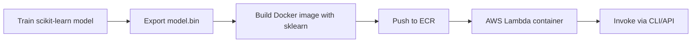
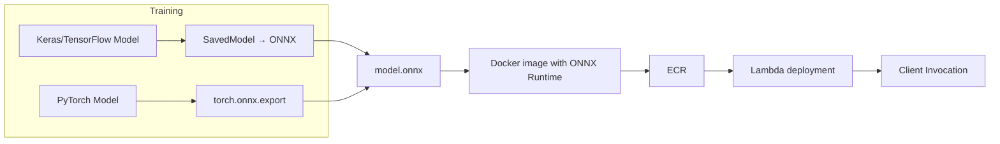

#  📺 Serverless Machine Learning & Deep Learning Deployment with AWS Lambda (Full Workshop Overview)
* 
* Video: https://www.youtube.com/watch?v=sHQaeVm5hT8

This is a summary of the workshop in  [he Serverless module (Module 9)](https://github.com/DataTalksClub/machine-learning-zoomcamp/tree/master/09-serverless) of 
[Machine Learning Zoomcamp](https://github.com/DataTalksClub/machine-learning-zoomcamp).

Each part of the video is summarised in Week9_2_workshop.md. However,  i dont think it's very exlicative without looking at the video.
I would advise to download the sources at https://github.com/DataTalksClub/machine-learning-zoomcamp/tree/master/09-serverless/workshop.
The Readme is quite easy to follow and learn.
---

## ✅ Learning Objectives 

By the end of this session, one will be able to:

* Understand how to deploy ML and DL models using AWS Lambda with Docker.
* Build a complete deployment pipeline: model preparation → Docker image → ECR upload → Lambda execution.
* Convert TensorFlow/Keras or PyTorch models to ONNX for lightweight inference.
* Test models locally and remotely via AWS CLI or boto3.

---

## 🧠 Core Concepts & Theory 

This workshop introduces **serverless deployment**, where compute resources are billed only during execution.
AWS Lambda serves as the execution engine, and Docker provides a fully controlled runtime environment capable of hosting ML/DL dependencies.

Two model families are addressed:

* **Traditional ML** (scikit-learn), exported as `.bin` via pickle.
* **Deep Learning** (TensorFlow/Keras or PyTorch), converted to **ONNX**, a standardized intermediate format enabling optimized inference using **ONNX Runtime**.

The architecture includes three major layers:

1. **Model building** (trained locally).
2. **Docker packaging** with the appropriate runtime + dependencies.
3. **Deployment to AWS Lambda** through Amazon ECR, followed by invocation via events, CLI, or API Gateway.

---

## 📋 Key Highlights & Takeaways

### **Main Themes** (3–5 points)

* Deploying scikit-learn models to AWS Lambda through Docker-based container images.
* Understanding cold vs warm starts and dependency handling in serverless functions.
* Converting deep learning models (TF/Keras/PyTorch) to ONNX for efficient deployment.
* Using ONNX Runtime as a lightweight inference engine inside Lambda.
* Invoking Lambda functions via the console, `aws lambda invoke`, or boto3 scripts.

### **Critical Details** (4–6 points)

* ML dependencies must be installed **in the system environment**, not in a virtualenv.
* PyTorch → ONNX export is simpler and typically produces smaller models than Keras/TensorFlow.
* Lambda cold starts load the model once; subsequent calls reuse memory.
* Docker images are stored in **ECR** and referenced by Lambda.
* `keras-image-helper` standardizes preprocessing for Keras models; PyTorch uses custom transforms.
* ONNX Runtime replaces TensorFlow Lite due to TF Lite compatibility issues on Amazon Linux.

---

## 💡 Examples & Practical Applications

* **Scikit-learn churn prediction:** local training, `.bin` export, Docker packaging, Lambda deployment, and boto3 invocation.
* **Keras InceptionV3 “clothing classifier”:** conversion to SavedModel, ONNX export via `tf2onnx`, local ONNX Runtime testing, Lambda deployment.
* **PyTorch MobileNet classifier:** direct ONNX export, custom preprocessing pipeline, local validation, and deployment via ECR → Lambda.
* Performance analysis of cold vs warm starts through repeated invocations.

---

## 📊 Conceptual Diagrams (Mermaid)

### **Traditional ML Deployment Pipeline**

---

### **Deep Learning Pipeline (Keras/PyTorch → ONNX)**

---

## ❓ Review Questions

---

### **Q1: Why is ONNX preferred over TensorFlow Lite for Lambda deployment?**

💡 Answer

TensorFlow Lite requires platform-specific binaries for Amazon Linux and is increasingly difficult to build and maintain.  
ONNX is framework-agnostic, compatible with TensorFlow and PyTorch, and **ONNX Runtime** is lightweight, stable, and ideal for Lambda environments.

---

### **Q2: What is the advantage of using Docker-based Lambda deployment over ZIP + Layers?**

💡 Answer

Docker allows complete control over the runtime environment, including system-level dependencies like numpy, sklearn, or onnxruntime.  
ZIP deployments are restricted, fragile, and often incompatible with compiled libraries needed by ML and DL workloads.

---

### **Q3: Outline the full process for deploying a PyTorch model on AWS Lambda.**

💡 Answer

1. Train a PyTorch model locally.  
2. Export it to ONNX using `torch.onnx.export`.  
3. Build a Docker image including ONNX Runtime, preprocessing code, and the ONNX file.  
4. Push the image to Amazon ECR.  
5. Create a Lambda function based on this image.  
6. Invoke it using the Lambda console, AWS CLI, or boto3.

---

