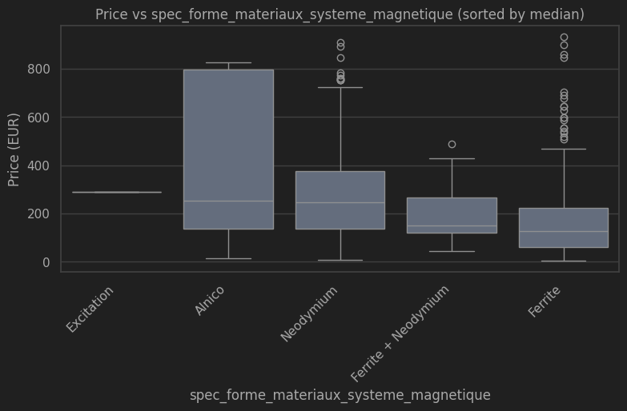
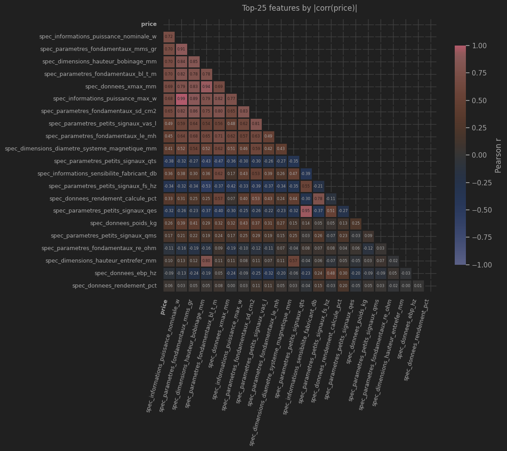
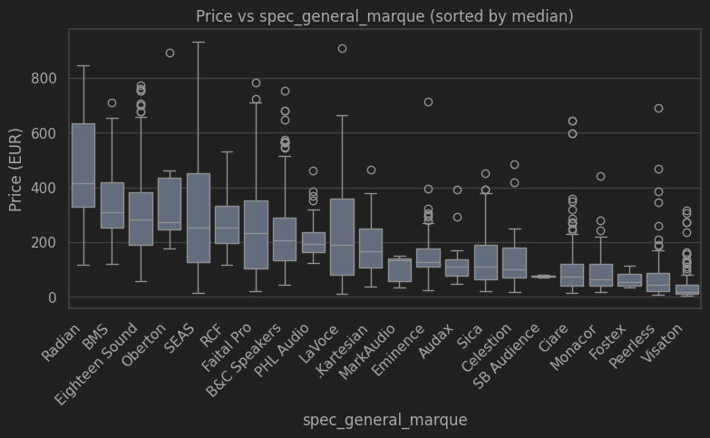
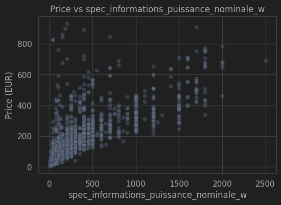
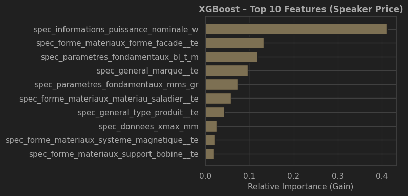
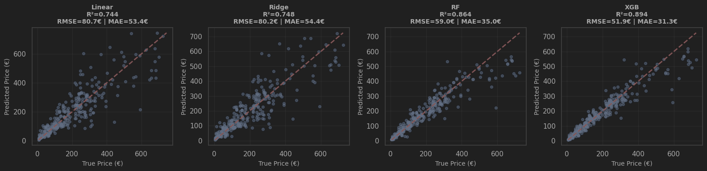
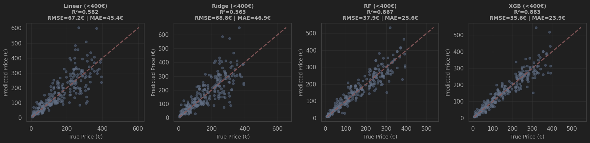

# Loudspeaker Price Prediction (Capstone)

End-to-end ML project to predict loudspeaker price from Thiele–Small (T/S) parameters and selected product features.

## Problem statement

Given loudspeaker driver specifications, estimate the market price. The model focuses on physical descriptors (T/S parameters) plus a few manufacturer attributes (brand, magnet type, power handling) that plausibly affect price.

## Physical context (short)

At low frequency, a direct-radiator driver can be modeled by a second-order band-pass system. A minimal, physically grounded parameter set is:

$$
R_e,\; Q_{es},\; Q_{ms},\; f_s,\; S_d,\; V_{as}
$$

From these, key mechanical/electrical quantities (e.g., $Q_{ts}$, $M_{ms}$, $C_{ms}$, $Bl$) can be derived. See `notebooks/Lot0_minimal_ts_explanation.md` for the short derivation and physical interpretation.

## Dataset


Source: historical supplier database (~3,000 entries, partially filled).  
Filtering: keep drivers with complete minimal T/S set, along with a small set of extra features (power, efficiency, magnet type, etc.).

The  T/S set parameters describe the physical behavior of the driver, and most of the other low‑frequency properties can be derived from them (see `Lot0_minimal_ts_explanation.md`). 

I then selected a few additional columns that might correlate with price, such as efficiency, nominal/max power, and magnet material. 

For exemple the magnet type is expected to matter (ferrite vs. neodymium, for example), while other fields are exploratory. One of my curiosities is whether price can cluster by brand when the physical parameters are similar.

Final dataset: `Datas/speaker_db_selected_refined.csv`


## Project structure

```
Capstone_1/
├── README.md
├── Datas/
│   ├── speaker_db_selected_refined.csv
├── notebooks/
│   ├── Lot0_minimal_ts_explanation.md
│   ├── Lot1_Data_analysis_and_cleaning.ipynb
│   ├── Lot2_EDA_price.ipynb
│   ├── Lot3_Modelling.ipynb
│   ├── Lot4_websevice_predict.py
│   ├── Lot4_websevice_test.ipynb
│   ├── Lot5_docker_summary.ipynb
│   └── smoothed_target_encoder.py
├── refactored_final_scripts/
│   ├── 1_train.py
│   ├── 2_predict.py
│   ├── 3_serve.py
│   ├── 4_test_server_predict.py
│   ├── smoothed_target_encoder.py
│   ├── Dockerfile
│   ├── pyproject.toml
├── requirements.txt
```

## Notebooks guide

- `notebooks/Lot0_minimal_ts_explanation.md` — physics background (minimal T/S set).
- `notebooks/Lot1_Data_analysis_and_cleaning.ipynb` — quick overview of features, missing values, and column roles.
- `notebooks/Lot2_EDA_price.ipynb` — EDA: price distribution, correlation, and feature relationships.
- `notebooks/Lot3_Modelling.ipynb` — model tuning + evaluation (Ridge, RF, XGBoost).
- `notebooks/Lot4_websevice_predict.py` — early local prediction script for the web service.
- `notebooks/Lot4_websevice_test.ipynb` — API testing notebook.
- `notebooks/Lot5_docker_summary.ipynb` — Docker notes and summary.

## Refactored scripts (recommended)

These are the production-ready scripts for training, local prediction, and API serving:

- `refactored_final_scripts/1_train.py` — grouped split + hybrid target encoding + log target training.
- `refactored_final_scripts/2_predict.py` — local, offline predictions using saved artifacts.
- `refactored_final_scripts/3_serve.py` — FastAPI service for single/batch inference.
- `refactored_final_scripts/4_test_server_predict.py` — API smoke test with real CSV rows.

## Quick start (local)

Python 3.11.* recommended (it's the one i used for this project)

```bash
python3.11 -m venv venv
source venv/bin/activate
python --version   # should say 3.11.x
pip install -r requirements.txt

```


Refactored pipeline (log target + hybrid target encoding):

```bash
python refactored_final_scripts/1_train.py
python refactored_final_scripts/2_predict.py
python refactored_final_scripts/3_serve.py
python refactored_final_scripts/4_test_server_predict.py
```

Look in notebooks and run them for more results. 
Basically :
- the EDA is only in the notebook. 
- The training was done onto linear,log, hybrid log and only the hybrid was kept in the refactored 


### Build & Run Locally

1. **Build Docker image**
   
   ```bash
   cd refactored_final_scripts
   docker build -f ./Dockerfile -t speaker-rating-api:latest .
   ```

2. **Run container**
   
   ```bash
   docker run -p 7860:7860 speaker-rating-api:latest
   ```

3. **Test the API**
   
   Run 4_test_server_predict.py
   
   ---


## Notes and Conclusions

The initial goal of this project was to investigate whether **speaker price** could be reasonably predicted using **Thiele–Small (T/S) parameters alone**, before progressively increasing model complexity.

More specifically, I wanted to answer the following questions:

* Are T/S parameters sufficient to explain a significant part of speaker pricing?
* Which parameters matter the most?
* Do the learned relationships align with physical and engineering intuition?

The project was designed as an **iterative modeling process**:

1. **T/S parameters only** (classical ML models)
2. **T/S parameters + additional technical features** (extended ML)
3. **Deep learning models** (exploratory, if justified)

---

### Data Preparation Limitations

A non-negligible amount of time was spent cleaning the dataset and transforming a scraped collection of heterogeneous strings into a usable numerical table. However, several limitations remain:

* Many values had to be dropped; with more time, some could likely be **recovered or derived** from other parameters using physical relationships.
* The dataset would clearly benefit from **a wider range of brands and manufacturers**. Merging multiple speaker databases is feasible but time-consuming due to differences in structure, naming conventions, and missing fields.

---

### Exploratory Analysis Scope

Initially, I also intended to explore **clustering of T/S parameters** jointly with **brand and price**, in order to detect potential price inflation effects or market positioning patterns.
Due to time constraints, this part was not implemented.

In order to meet the **capstone project objectives**, I chose to prioritize:

* A **minimal but functional EDA**
* A **working end-to-end modeling pipeline**

As a result, the analysis remains comparable in depth to the midterm project:

* No deep learning models
* Limited interpretability and contextualization of results
* No cloud deployment






### Short version of the model training

  - Model: a regression model trained to predict speaker price using the dataset’s technical specs and categorical fields (brand,
    magnet type, etc.). In the refactored pipeline, the target is log1p(price) so the model focuses on relative errors and handles the
    long price tail better.
  - Why this model setup: prices span a wide range and are skewed; taking log1p stabilizes variance and helps the model fit both cheap
    and expensive speakers without over‑weighting high prices.
  - Target encoding: categorical columns are replaced by a smoothed estimate of the average price for that category (computed on
    training data only). It keeps useful signal from high‑cardinality fields (like brand or reference) without exploding the feature
    space like one‑hot encoding, and the smoothing reduces overfitting for rare categories.

### Key Observations

Despite the limited scope, several interesting (and sometimes surprising) observations emerged:

* From both **correlation analysis** and **XGBoost feature importance**, **nominal power** appeared to be a stronger predictor of price than most T/S parameters.
* Many of the top features were **highly correlated with each other**.

  * Some of these correlations make sense **physically**.
  * Others are more understandable from an **engineering or manufacturing perspective**.
  * A few remain puzzling and would require deeper investigation.

These results suggest that **pricing is influenced at least as much by engineering constraints and product positioning as by pure electro-acoustic performance metrics**.





---

### Project Assessment

Within the context of the training program, the project **meets the expected objectives**.
However, it falls short of the level of depth I originally aimed for.

Given the constraint of building a full pipeline—from a partially usable dataset to a trained and explained model—in roughly **five hours**, several design and analysis steps had to be simplified or skipped, resulting in a more **brute-force approach** than initially intended.

---

### Future Work

This project will be extended with a more rigorous and structured approach:

* Merge and harmonize **multiple speaker databases** to increase coverage and diversity.
* Focus first on **T/S parameters only** at first, with stronger physical interpretability.
* Incrementally introduce additional features and **analyze their marginal impact**.
* Investigate the **physical and engineering meaning** behind highly correlated feature groups.
* Introduce **deep learning models**  once simpler models are fully understood and justified.
* Use uv, pip requirement.txt is a pain to redeploy and test. And slow.