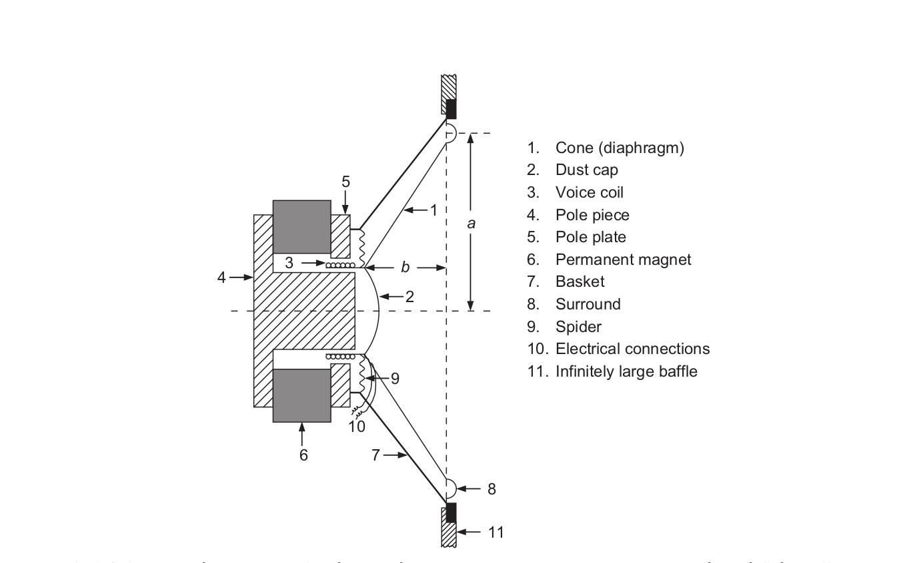

# Minimal Thiele-Small (T/S) loudspeaker simulation (second-order band-pass)

This note gives the minimal, physically grounded model to simulate a direct-radiator loudspeaker at low frequency using Thiele-Small parameters. It connects the 2nd-order band-pass transfer function to the smallest useful T/S parameter set, and includes basic efficiency/sensitivity links.

Fig. 1 : Cross-sectional sketch of a direct-radiator loudspeaker assumed to be mounted in an infinite baffle. ['Acoustics: sound fields, transducers and vibration' Beranek & Mellow, 2012, p278]

## 1) Minimal low-frequency model

Assume a rigid piston, infinite baffle, small-signal, low-frequency operation. The loudspeaker behaves as a single-degree-of-freedom resonator. The normalized **velocity transfer function** is the canonical 2nd-order band-pass:

$$
\beta_c(f) = \frac{j\,\frac{f}{f_s}}{1 - \left(\frac{f}{f_s}\right)^2 + j\,\frac{1}{Q_{ts}}\,\frac{f}{f_s}}
$$

The actual cone velocity (complex amplitude) is

$$
\tilde u_c = \frac{\tilde e_g}{B\,l\,Q_{es}}\,\beta_c(f)
$$

where $\tilde e_g$ is the generator voltage, $Bl$ is the force factor, and $Q_{es}$ is the electrical Q.

From velocity you can derive acceleration and displacement with the canonical high-pass and low-pass forms:

$$
\tilde a_c = j\,2\pi f\,\tilde u_c,\quad
\tilde x_c = \frac{\tilde u_c}{j\,2\pi f}
$$

Fig. 2 : Normalized voice-coil displacement, velocity, and acceleration.

The solid line is for $Q _ { T S } = 1 / \sqrt { 2 }$ . The dashed line is for $Q _ { T S } = 2$ . ['Acoustics: sound fields, transducers and vibration' Beranek & Mellow, 2012, p285]

## 2) Minimal T/S parameter set and relations

A complete low-frequency model can be built from six independent parameters:

$$
R_e,\; Q_{es},\; Q_{ms},\; f_s,\; S_d,\; V_{as}
$$

Key relations:

$$
Q_{ts} = \frac{Q_{es}\,Q_{ms}}{Q_{es}+Q_{ms}}
$$

$$
C_{ms} = \frac{V_{as}}{\rho_0 c^2 S_d^2}
$$

$$
M_{ms} = \frac{1}{(2\pi f_s)^2\,C_{ms}}
$$

$$
R_{ms} = \frac{1}{Q_{ms}}\sqrt{\frac{M_{ms}}{C_{ms}}}
$$

$$
Bl = \sqrt{\frac{R_e}{2\pi f_s\,Q_{es}\,C_{ms}}}
$$

These allow you to compute the mechanical/electrical equivalent circuit values directly from the minimal T/S set.

## 3) Sensitivity in the stable acceleration region

In the mid-band (above resonance, below inductive rise), the on-axis pressure is proportional to cone acceleration. A compact sensitivity expression consistent with this region is:

$$
\mathrm{SPL} = 20\log_{10}\!\left(\frac{u}{2\,Q\,r\,c\,\cdot 20\,\mu\mathrm{Pa}}\,\sqrt{\frac{2\pi f_s^{3} V_{as} \rho_0}{(R_g + R_e) Q_{es}}}\right)
$$

where $u$ is the RMS drive voltage, $Q$ is the directivity factor ($Q=2$ for half-space), and $r$ is the measurement distance (usually 1 m). If you want the usual 1 W / 1 m sensitivity, take $u = \sqrt{Z_{nom} W}$ (e.g., 2.83 V for 8 $\Omega$).

## 4) Reference efficiency (useful "basic property")

In the mid-band where inductance is negligible and above resonance, the **reference efficiency** can be expressed in terms of T/S:

$$
\eta_0 \approx \frac{8\pi^2\,V_{as}\,f_s^3}{Q_{es}\,c^3}
$$

This shows that high efficiency comes from high $V_{as}$, high $f_s$ (for a fixed driver size), and low $Q_{es}$.

A common conversion between efficiency and sensitivity (half-space, 1 m) is

$$
\mathrm{SPL} \approx 112 + 10\log_{10}(\eta_0)\quad \text{dB SPL / W / m}
$$

(Adjust the constant if a different radiation space is assumed.)

# 

## 