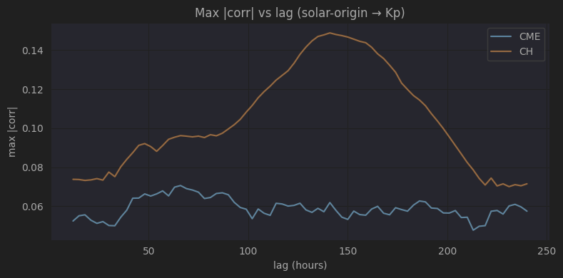
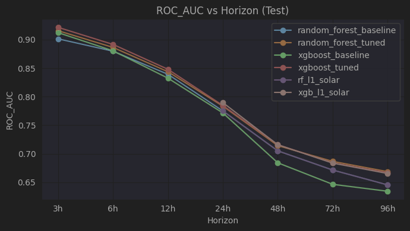

# EXT1_DL_solar — Solar-Origin Extension (Prototype)

This folder implements the **solar-origin extension** outlined in `Data/target_6_solar_origin_extension.txt`.  
Goal: **extend forecast horizon beyond 24–48h** by adding **solar-origin predictors** (CME + coronal holes), and optionally learning a **solar→L1 bridge**.

The work here is **prototype / research scaffolding**, not a production pipeline.

---

## Why this extension

The core project uses only L1 solar-wind drivers, which naturally limits predictability at longer lead times.  
Solar-origin signals (CME catalogs + coronal-hole inventories) provide **earlier causal cues** and could extend skill to **48–96h**.

---

## What was done (mapped to target_6)

### Step 0–1: Build a solar-origin timeline (3h grid)
**Notebook: `A6a_deeplearning_CME.ipynb`**
- Ingests **SOHO/LASCO CME catalog** from `Data/univ_all.txt`.
- Parses event metadata (speed, width, CPA, etc.).
- Bins events to a **fixed 3h grid** (assign to *next* grid cell after event start).
- Outputs: `Data/processed/solar_origin_cme_features.parquet`.

**Notebook: `A6b_deeplearning_corona_holes.ipynb`**
- Queries **SPoCA coronal-hole catalog** via OMA TAP (`https://vo-tap.oma.be/tap`).
- Saves yearly raw slices in `Data/processed/solar_origin_raw/`.
- Resamples to **3h cadence** with area/centroid/polarity/persistence aggregates.
- Outputs: `Data/processed/solar_origin_ch_features.parquet`.

**Notebook: `A6c_merge_solar_origin_features.ipynb`**
- Merges CME + CH features into a single **3h timeline**.
- Enforces uniform cadence and monotonic timestamps.
- Missingness policy:
  - CME counts → 0
  - CH area/persistence → 0
  - Means/centroids → forward-fill
  - Adds missingness flags for CH fields
- Outputs: `Data/processed/solar_origin_features.parquet`.

### Step 2: Build optional solar→L1 targets
**Notebook: `A6d_build_solar_to_l1_targets.ipynb`**
- Uses `Data/processed/master_3h.parquet` (L1).
- Creates targets at **24h / 36h / 48h / 96h** lead times:
  - `bz_gsm_3h_min`
  - `sw_speed_3h_mean`
  - `sw_density_3h_mean`
- Outputs: `Data/processed/solar_to_l1_targets.parquet`.

### (Step 3: Train solar→L1 models (optional bridge))
**Notebook: `A6e_train_solar_to_l1_model.ipynb`**
- Builds lagged CME/CH features (CME lags 12–96h, CH lags 120–240h).
- Time-based split per horizon (70/15/15).
- Models: **Ridge** and **RandomForest** regressors.
- Outputs:
  - `Data/processed/results_solar_to_l1.csv`
  - `Data/processed/solar_to_l1_predictions.parquet`
  - `Data/processed/results_solar_to_l1_best.csv`
  - `Data/processed/solar_to_l1_predicted_l1.parquet`

Note :  The Solar→L1 models were trained and saved, but their predictions were not used downstream in the aurora classifier. The main path used true L1 + solar-origin features (not predicted L1).
### Step 4: L1 + solar-origin aurora model (main path)
**Notebook: `A6e_train_solar_to_l1_model.ipynb` (later section)**
- Extends the **existing L1 features** with **solar-origin lags** (CME + CH).
- Walk-forward split (60/20/20) and baseline RF + tuned XGB.
- Outputs:
  - `Data/processed/results_l1_solar_rf.csv`
  - `Data/processed/results_l1_solar_xgb.csv`
  - `Data/processed/preds_l1_solar_rf.parquet`
  - `Data/processed/preds_l1_solar_xgb.parquet`

---

## Main results 

### L1 + solar-origin aurora classifier

- **Figure 3 — Max |corr| vs lag (solar→L1)**  

- **Figure 4 — L1 vs L1+solar model comparison (r0c-auc)**  

- 

Adding simple solar-origin features (e.g., CME counts, coronal-hole occurrence) provides only **marginal improvement (ΔROC-AUC ≈ 0.01–0.03)** and often no measurable gain for Kp prediction. This is expected because **Kp is primarily controlled by near-Earth solar-wind and IMF conditions—especially sustained southward (B_z)**—which are not encoded by basic solar event counts.

Solar-origin data contains physically real but highly filtered signal; without information on **Earth-directed geometry, magnetic orientation, and propagation**, its standalone contribution remains limited. Meaningful gains are more likely from **physics-informed solar features** (e.g., Earth-directed CME identification, arrival-time modeling, IMF orientation proxies) rather than raw catalog statistics.

Look at A6e_train_solar_to_l1_model.ipynb for more details.

---

## Notes / limitations

- CME catalog is **local** (`Data/univ_all.txt`) and must be present.
- Coronal-hole data requires **live TAP access** to OMA/SPoCA.
- Solar→L1 performance is **weak for Bz**, which limits downstream gains.
- This is **future-work scaffolding**, not productionized.

---

## How to run (quick order)

1. `A6a_deeplearning_CME.ipynb`  → CME features  
2. `A6b_deeplearning_corona_holes.ipynb` → CH features  
3. `A6c_merge_solar_origin_features.ipynb` → merged solar timeline  
4. `A6d_build_solar_to_l1_targets.ipynb` → solar→L1 targets  
5. `A6e_train_solar_to_l1_model.ipynb` → solar→L1 models + L1+solar aurora models
