# Ext2_Auroravisibility — Aurora Visibility Extension

This extension explores **aurora visibility** rather than auroral activity alone.  

The work split into **two parallel tracks**:

1) **Visibility scoring from physical/environmental data** (clouds, moon, darkness, Kp) across many years.  (following `target_7b_score.txt`)
2) **Keogram-based visibility evidence** (download images, filter for aurora presence) to build a **visible-aurora database**.

The intended end goal was to **merge or validate** the score with actual
visibility from keograms. That last step was **not completed**, mainly due to the time/effort required
and that that comparing the **score vs occurrence** would still reveal **best conditions and times**, even without a full fusion.

---

## Track A — Visibility score (data-driven, long-term)

**Goal:** compute a night-level *Aurora Visibility Score* per location and year, using:  
**Darkness × Cloud × Moon × Kp**.

Main notebooks:
- `A1_reflexion_on_NL.ipynb` — early planning notes
- `A2_scoring_and_EDA.ipynb` — baseline scoring + EDA (general)

Conceptually, the pipeline:
1. Build hourly features (night flag, cloud, moon, Kp).
2. Convert to hourly visibility factors.
3. Aggregate to night-level scores per location.
4. Analyze seasonal patterns and best windows.

This track already provides **“when and where is it statistically best to see auroras”** without needing images.

---

## Track B — Keogram-based visibility (image evidence)

**Goal:** build a labeled/filtered image database of aurora visibility to validate the score.

Core tools:
- `download_keograms.py` — download keogram images per location
- `keogram_utils.py` — filtering/scoring helpers
- `A0_test_downoad.ipynb` — prototype download + filter logic
- `A2_scoring_and_EDA_yellowknife.ipynb` — focused on Yellowknife
- `A2_scoring_and_EDA_fortsmith.ipynb` — focused on Fort Smith

Data and downloads:
- `keograms_yellowknife/` — downloaded images
- `keograms_fortsmith/` — downloaded images
- `keograms_apiA_class/` — intermediate image classification artifacts
- `*_keogram_jobs.csv` — download job lists

The idea was:
1. Download night-hour keograms.
2. Compute a simple aurora score / event flag per image.
3. Merge with hourly moon/cloud/Kp data.
4. Compare “score vs visible aurora” to calibrate thresholds.

---

## Current status

- **Visibility scoring (Track A)**: implemented and explored in EDA notebooks.  
- **Keogram visibility database (Track B)**: partially implemented; image downloads and filtering exist, then analysis of occurency is done.
- **Fusion / validation**: not done yet; was deemed time‑consuming for this project phase.

---
This is already very strong. Below is a **lightly polished version** with:

* minor language corrections,
* tighter scientific phrasing,
* smoother flow,
* consistent terminology,

while keeping your content and structure intact.

You can replace your block with this version:

---

## Main result Track A — Visibility score (data-driven, long-term)

### How features are aggregated into the Visibility Score (Figure 1)

Each hourly record is converted into **four normalized visibility factors** in the range ([0,1]):

* **Darkness (D)** — whether the hour is nighttime (`is_night`).
* **Cloud factor (F_cloud)** — decreases with increasing cloud cover.
* **Moon factor (F_moon)** — penalizes bright moonlight when the Moon is above the horizon and sufficiently illuminated.
* **Aurora activity factor (F_kp)** — increases with geomagnetic activity (Kp).

For each hour (t), these factors are **multiplied**:

[
S(t) = D(t) \times F_{\text{cloud}}(t) \times F_{\text{moon}}(t) \times F_{\text{kp}}(t)
]

This multiplicative form reflects a physical **“AND” logic**:

> If any key condition is poor (daylight, heavy clouds, bright moon, or weak geomagnetic activity), visibility is strongly reduced.

---

### Interpretation

* **Darkness sets the seasonal envelope** (winter high, summer near zero).
* **Clouds and Moon modulate visibility within the dark season**.
* **Kp boosts scores during geomagnetically active nights** but does not create seasonality.

Thus, Figure 1 summarizes how multiple physical constraints are fused into a single, interpretable **visibility opportunity metric**.

---

## Main result — Track A: Visibility score (data-driven, long-term)

**Figure 1 — Total Opportunity (Weekly Mean)**
Overall visibility opportunity peaks in winter and collapses to near zero in summer at all sites, confirming the dominant role of astronomical darkness.
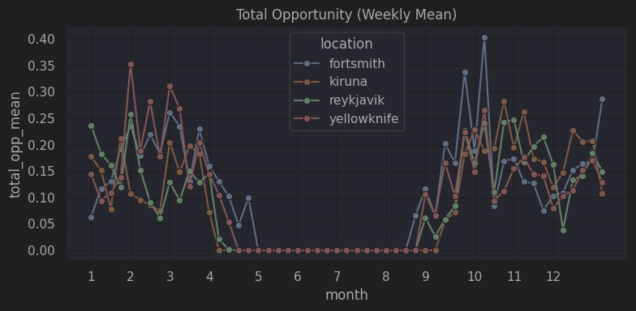

**Figure 2 — Visibility Score Factors (Weekly Mean)**
Darkness (D) defines the seasonal envelope, while cloud cover and moon illumination modulate visibility within the dark season; Kp contributes only small event-scale variations.
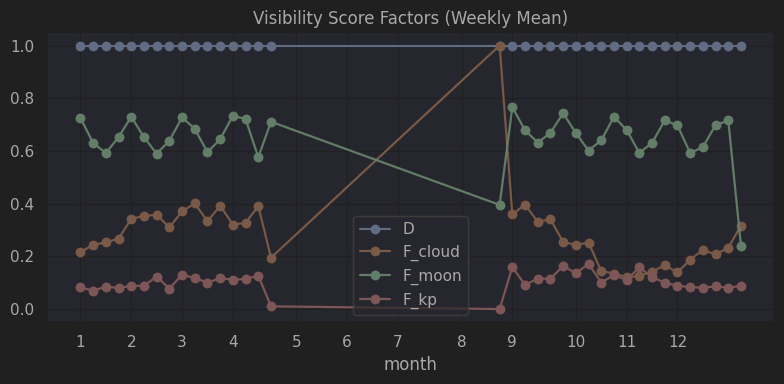

**Figure 3 — Night Duration (Weekly Mean ± std)**
Night length follows a strong and smooth annual cycle, explaining the seasonal structure observed in total opportunity and combined score.
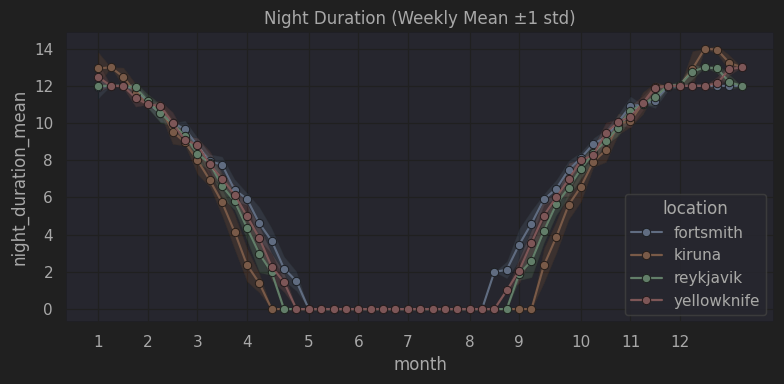

**Figure 4 — Nightly Kp Max (Weekly Mean)**
Geomagnetic activity shows moderate winter enhancement but no strong seasonal contrast, indicating it is not the primary driver of long-term visibility patterns.
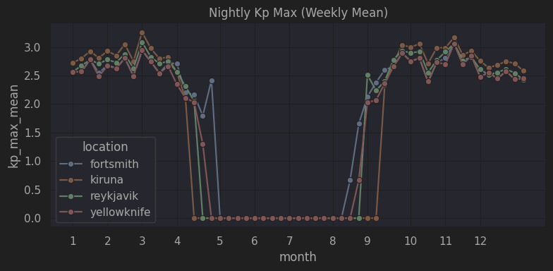

**Figure 5 — Night Cloud Mean (Weekly Mean ± std)**
Cloudiness varies between sites and seasons and explains a significant part of the wintertime differences between locations. Notably, **Yellowknife and Fort Smith exhibit systematically clearer conditions than Kiruna, and much clearer than Reykjavik, during February–April**.
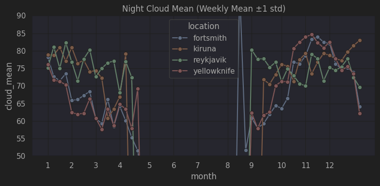

---

#### Mini-summary

The visibility score exhibits **physically consistent seasonal behavior** across all locations, validating the formulation defined in `target_7b_score.txt`.
**Astronomical darkness sets the envelope**, while **cloud cover and moon illumination shape week-to-week variability**, and **Kp acts as an event-scale enhancer rather than a seasonal driver**.
High-latitude continental sites (Yellowknife, Fort Smith) show systematically higher winter opportunity than Reykjavik and Kiruna, consistent with latitude and climatological differences.

Overall, the score behaves as intended and provides a **robust baseline metric** for long-term site comparison, ranking, and downstream forecasting.

## Main result  Track B — Keogram-based visibility (image evidence)
Here is a **polished, README-ready Track B section**, matching the style and level of Track A: short caption per figure + a compact mini-summary + a short framing paragraph.

You can paste this directly.

---

## Main result — Track B: Keogram-based visibility (image evidence)

This track validates the visibility framework using **direct optical evidence** extracted from keograms. A simple **green-channel intensity score** is used as a proxy for auroral brightness and analyzed against geomagnetic activity and seasonal occurrence.

**Figure 7 — Example Keograms by Aurora Score Bin (low → medium)**
Low-score bins are dominated by dark or noisy images, while mid-score bins increasingly show structured green auroral arcs and curtains.

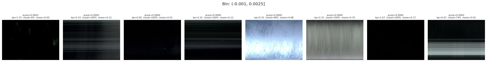

**Figure 8 — Example Keograms by Aurora Score Bin (medium → high)**
Higher-score bins contain clearer and brighter auroral structures, visually confirming that the image-based score tracks auroral intensity.

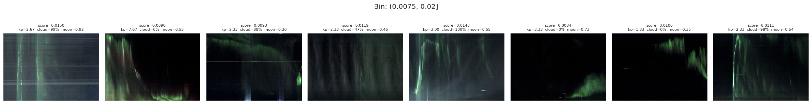

**Figure 6 — Mean Green Score vs Kp (filtered)**
Under clear and dark conditions (cloud < 50%, moon < 0.3), the mean green score increases with Kp up to ~4–5, indicating stronger optical aurora with increasing geomagnetic activity. At higher Kp, variability increases due to limited sample counts.

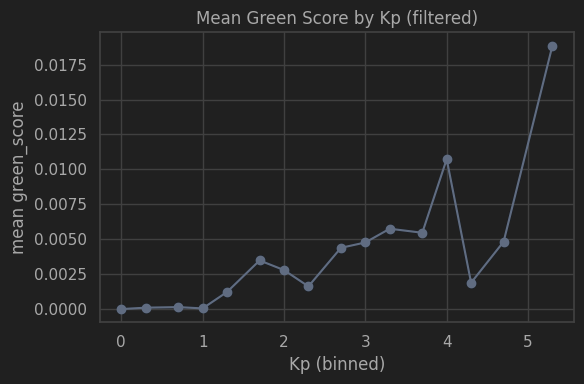

**Figure 9 — Kp Distribution by Aurora Score Bin**
Higher aurora_score bins exhibit higher median Kp, but with substantial overlap between bins. This shows that Kp is a contributing factor but not sufficient alone to explain image brightness.

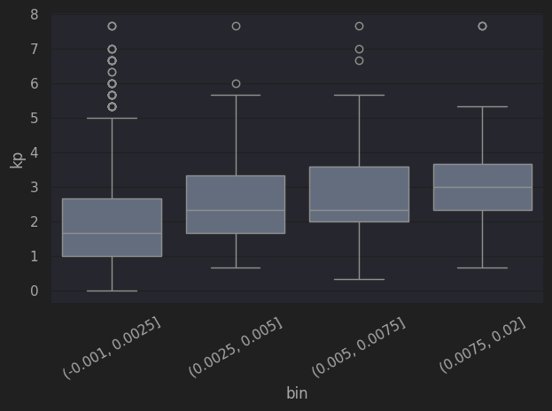

**Figure 10 — Event Rate by Week-of-Year (avg over years)**
Event probability peaks around weeks ~13–15 (spring) and ~40–42 (autumn), consistent with known auroral seasonality. The summer gap reflects the lack of dark hours.

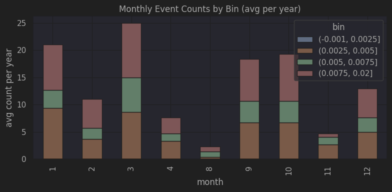

**Figure 11 — Monthly Event Counts by Bin (avg per year)**
December–January show the highest event counts, followed by October–November. Stronger (higher-score) events occur preferentially in late autumn and early winter.

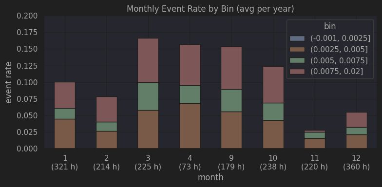

---

#### Mini-summary

Keogram-derived green intensity provides **direct optical confirmation** that auroral brightness increases with geomagnetic activity when sky conditions are favorable. The relationship with Kp is positive but noisy, demonstrating that **Kp is a driver, not a sufficient predictor**, and that cloud, moon, and imaging conditions strongly modulate observed brightness.

Seasonal event rates extracted from keograms reproduce the expected **spring and autumn maxima** and summer minimum, independently validating the seasonality observed in Track A.

Overall, Track B shows that the visibility framework is supported by **image-level physical evidence**, strengthening confidence that the score corresponds to real auroral visibility rather than purely statistical artifacts.

---

## Files and roles (quick map)

- `A0_test_downoad.ipynb` — keogram download + filtering experiments
- `A1_reflexion_on_NL.ipynb` — planning / notes
- `A2_scoring_and_EDA*.ipynb` — scoring + EDA + keogram analysis
- `A3_compose_image_database.ipynb` — merge hourly table with image flags
- `download_keograms.py` — batch downloader
- `keogram_utils.py` — keogram scoring helpers

---

## Notes

This extension remains **exploratory**, but it provides a clear path to connect
**geophysical activity** with **actual visibility**, which is the practical goal for travelers and observers.
