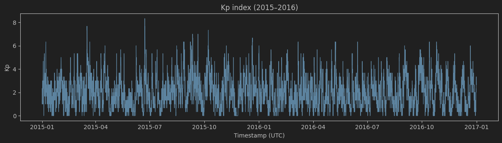
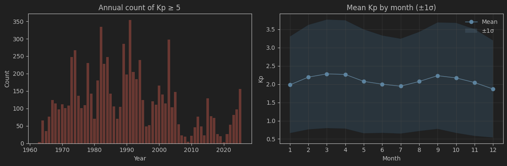
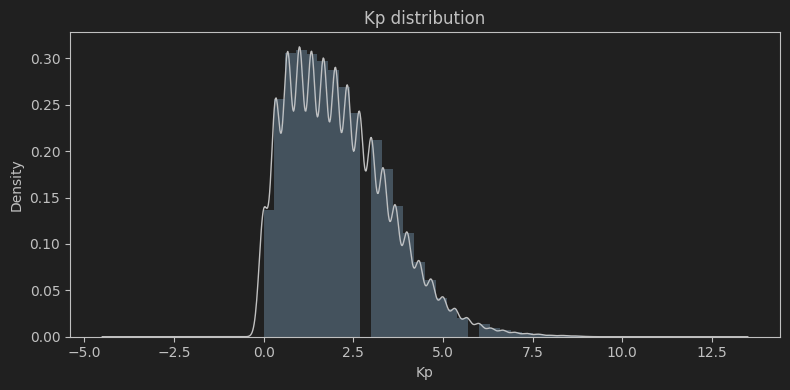
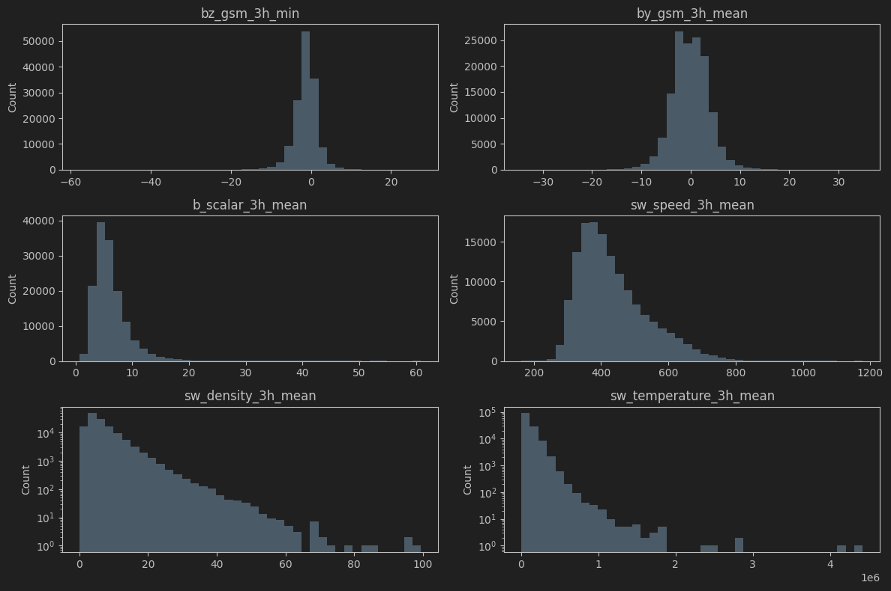
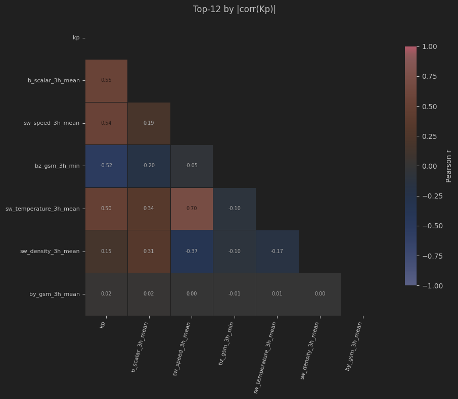
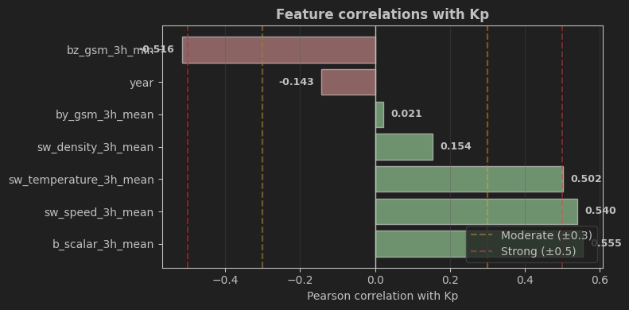
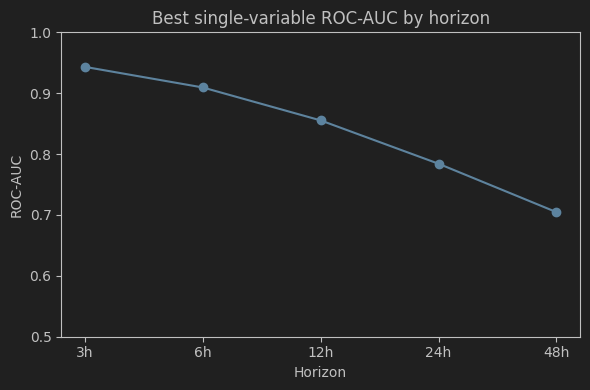
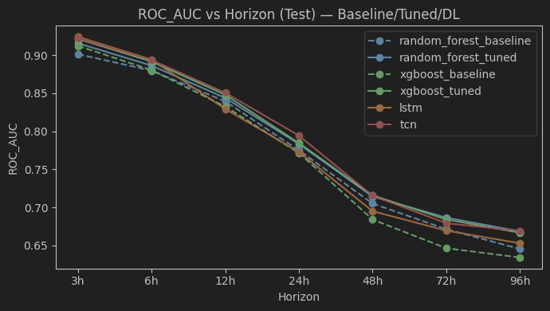
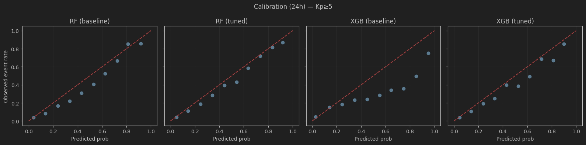
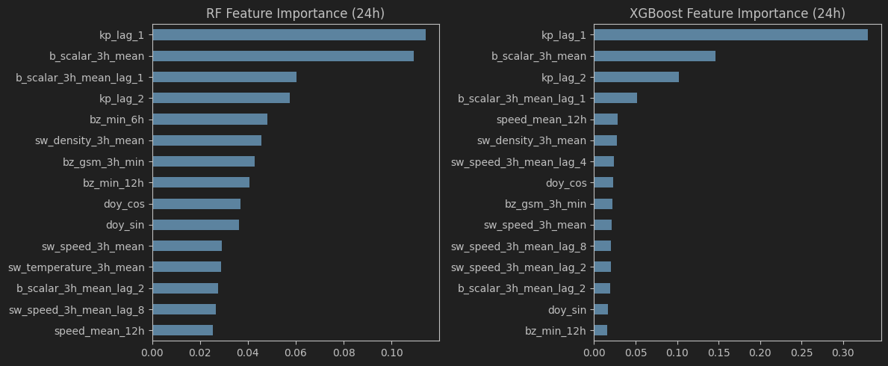

# Short‑Term Auroral Activity Prediction (L1 Solar Wind)

This project predicts the **probability of auroral activity (Kp ≥ 5)** over multiple horizons using **L1 solar‑wind and IMF drivers** with strict leakage control and walk‑forward validation.


### Problem Statement

Auroral activity (aurora borealis) is driven by geomagnetic disturbances resulting from interactions between the solar wind, the interplanetary magnetic field (IMF), and Earth’s magnetosphere.
Operational indices such as **Kp** and **OVATION** summarize this activity but do not explicitly expose **when** and **under which conditions** auroral activity is predictable.

This project investigates whether **supervised machine-learning models**, trained on **physically meaningful solar wind and geomagnetic drivers**, can predict **short-term auroral activity**, and how **predictability evolves with forecast horizon and solar context**.


---
## Project Goals

- Build a **leakage‑free** feature/target pipeline.
- Quantify **predictability vs horizon** (3h → 96h).
- Establish **baseline** and **tuned** classical ML results.
- Test **DL sequence models** on the same dataset.
- Provide **API + Docker** deployment for a selected model.

---


## 📁 Project Structure (high‑level)

```
├── aurora_DL_final_scripts
│   ├── 1_train.py
│   ├── 2_predict.py
│   ├── 3_serve.py
│   ├── 4_test_server_predict.py
│   └── results
├── aurora_ML_final_scripts
│   ├── 1_train.py
│   ├── 2_predict.py
│   ├── 3_serve.py
│   ├── 4_test_server_predict.py
│   ├── Dockerfile
│   ├── readme_Hugginface_deploy.txt
│   └── results
├── Notebooks
│   ├── A0a_clean_kp_ap_data.py
│   ├── A0b_resample_omni_3h.py
│   ├── A0c_align_merge_master_3h.py
│   ├── A0_clean_merge_dataset.ipynb
│   ├── A1_EDA.ipynb
│   ├── A2_FeatureEngineering.ipynb
│   ├── A3_BaselineModels.ipynb
│   ├── A4_ModelTuning.ipynb
│   └── A5_DeepLearning.ipynb
├── pyproject.toml
├── README.md
└── uv.lock
```

* **`Notebooks/`**
  Step-by-step development of the project: data cleaning, exploratory analysis, feature engineering, baseline models, tuning, and deep-learning experiments. This folder documents the **analysis workflow and reasoning** behind the final models.

* **`aurora_ML_final_scripts/`**
  Refactored, production-oriented **machine-learning pipeline** (training, prediction, serving, testing). This is the **reference implementation** used for deployment and inference.

* **`aurora_DL_final_scripts/`**
  Refactored **deep-learning pipeline**, kept mainly for comparison and protocol validation. It mirrors the ML structure but did not provide significant performance gains.

* **`pyproject.toml` / `uv.lock`**
  Dependency definition and locked environment for reproducibility.

* **`README.md`**
  Project documentation, methodology, results, and usage instructions.


---

## Local Setup (Dependencies)


This repository uses **`uv`**, a fast Python package manager that handles **virtual environment creation** and **dependency installation** directly from `pyproject.toml`.

### Install `uv`

```bash
pip install uv
```

Check installation:

```bash
uv --version
```

### Create the environment & install dependencies

```bash
uv venv .venv
uv sync
```

Activate if needed:

```bash
source .venv/bin/activate
```


## Quickstart (Local)

> `Data/processed/features.parquet` and `targets.parquet` are included for a fast start.
> Raw data preparation (`A0*`, `A2**.ipynb`) can be reproduced but is not required.

1. **(Optional) Prepare raw data**

```bash
jupyter notebook Notebooks/A0_clean_merge_dataset.ipynb
```

→ `Data/processed/master_3h.parquet`

2. **Train a model (ML)**

```bash
cd aurora_ML_final_scripts
python 1_train.py
```

3. **Serve & test locally**

```bash
python 3_serve.py
python 4_test_server_predict.py
```

---

##  DataSet
This project builds a **3‑hourly, physics‑safe dataset** by aligning the official Kp index with L1
  solar‑wind/IMF drivers from OMNI2. The final model input is a single, cleaned table with a consistent time
  grid and minimal leakage risk.

`features.parquet` and `targets.parquet` are the data necessary to train the models and are given in `Data/processed/features.parquet`

Those two are obtained from running `A2_FeatureEngineering.ipynb` computing `Data/processed/master_3h.parquet` 

`master_3h.parquet` is normally obtained from A0**.py codes but the original data are quite heavy >50Mo for Github so i didn't included them here. The complete explanation to download those original data is however given in the following.

  This project uses two authoritative sources:

  ### 1) Planetary Kp (GFZ / ISGI) — **official target**
  **URL:** https://kp.gfz.de/en/data

  - File expected in `Data/`: `kp_ap.txt`
  - This is the **official planetary Kp index** used as the trusted target.
  - The Kp series defines the **3‑hour time grid** and is treated as the ground‑truth label.

  **What’s inside `kp_ap.txt`:**
  - `year, month, day, hour_start, hour_mid, days_start, days_mid, kp, ap, definitive_flag`
  - Kp is a discrete index (0–9 in thirds).


  ### 2) OMNI2 Solar Wind / IMF (NASA OMNIWeb) — **drivers**
  **URL:** https://omniweb.gsfc.nasa.gov/form/dx1.html
  Download the **OMNI2 (hourly)** dataset and save as:

  - `Data/omni2_data_2.lst` (A0b script), or
  - `Data/omni2_data.lst` (A0 notebook)

  Both filenames are accepted in the A0 scripts/notebook.

  **What’s inside OMNI2:**

  IMF (Interplanetary Magnetic Field)

  - b_scalar: magnitude of IMF |B| (nT). Overall field strength.
  - by_gsm: IMF By component in GSM coordinates (nT). East‑west component.
  - bz_gsm: IMF Bz component in GSM (nT). Southward (negative) Bz is strongly geoeffective.

  Solar‑wind plasma

  - sw_speed: solar‑wind speed (km/s). Higher speed → stronger coupling.
  - sw_density: proton density (cm⁻³). Affects dynamic pressure.
  - sw_temperature: proton temperature (K). Proxy for solar‑wind state.

  Geomagnetic indices (for comparison only)

  - kp_index: OMNI’s Kp proxy (Kp×10). Not used for targets to avoid leakage.
  - ap_index: linear planetary ap index (nT). Also not used for targets.


  Missing values are flagged (e.g., 999.9 / 9999 / 9999999) and converted to NaN.


  ### How to Download (Quick Steps)

  1) **Kp data**
     - Go to https://kp.gfz.de/en/data
     - Download the `kp_ap.txt` file (definitive Kp + ap)
     - Place it in: `Data/kp_ap.txt`

  2) **OMNI2 hourly data**

  URL: https://omniweb.gsfc.nasa.gov/form/dx1.html

  What to download :
  Select the following variables:

  - IMF Magnitude Avg (nT) → b_scalar
  - By, GSM (nT) → by_gsm
  - Bz, GSM (nT) → bz_gsm
  - Proton Temperature (K) → sw_temperature
  - Proton Density (n/cc) → sw_density
  - Flow Speed (km/s) → sw_speed
  - Kp*10 index → kp_index (later divide by 10)
  - ap index (nT) → ap_index

  Download format:

  - Resolution: hourly
  - Output file: save as
    Data/omni2_data_2.lst

  ---
## Targets

A common rule of thumb: Kp ≥ 5 indicates geomagnetic storm conditions, which often correspond to aurora
  visibility beyond the usual high‑latitude regions. That’s why Kp ≥ 5 is widely used as an “auroral activity”
  threshold.

**Target definition (per horizon H):**

```
target_H(t) = 1 if max(Kp[t+1 : t+H]) ≥ 5 else 0
```

**Horizons used:** 3h, 6h, 12h, 24h, 48h, 72h, 96h


  Stronger thresholds:

  - Kp 6–7 → aurora can be seen at mid‑latitudes
  - Kp 8–9 → major storms, aurora at much lower latitudes


---

## Exploratory Data Analysis (EDA) 

### Target analysis
 Target analysis (A1_EDA.ipynb) shows a strongly right‑skewed Kp distribution with most values near 1–3 and
  rare storm events (Kp ≥ 5). Event counts vary over time with clear solar‑cycle peaks (clusters of active
  years), and seasonal effects are visible but secondary. This justifies framing the task as rare‑event
  prediction and evaluating performance across multiple forecast horizons.






### Features analysis




  Solar‑wind drivers are non‑Gaussian and heavy‑tailed: Bz/By are centered near 0 with rare extreme
  excursions, magnetic field magnitude is right‑skewed, and speed/density/temperature span orders of
  magnitude. Storms live in the tails, so scaling and robust handling of extremes are essential.





  Instantaneous relationships show physically consistent but moderate associations between Kp and key drivers
  (Bz, speed), with clear inter‑driver collinearity. No single driver explains Kp by itself → motivates
  multivariate and lagged features.



 A single strong driver can reach high short‑horizon AUC (~0.94 at 3h) but decays steadily with horizon
  (~0.78 by 24h). Signal remains above chance even at 24h, suggesting regime persistence rather than
  instantaneous triggering.


 Geomagnetic activity is conditional, persistent, and multivariate. The data are heavy‑tailed, partially
  collinear, and horizon‑dependent, which justifies lagged/rolling features, careful scaling, and evaluating
  models across multiple forecast horizons.

## Feature Design (Physics‑Safe)

  We restrict features to information available at time t and to short, physically plausible memory (≤24h).
  This avoids leakage and keeps the model aligned with known solar‑wind coupling timescales.

  - Raw drivers at time t
    IMF Bz/By (GSM), solar‑wind speed, density, temperature, and |B|. These are the direct L1 conditions that
    drive near‑Earth geomagnetic response.
  - Short lags (3h–24h)
    Lags at 1, 2, 4, 8 steps (3h, 6h, 12h, 24h) capture persistence and delayed response without using long
    historical context.
  - Rolling summaries (windowed physics)
    We take Bz minimum over short windows (captures sustained southward IMF) and speed mean over windows
    (captures persistent high‑speed streams). This encodes “worst‑case” coupling vs. “background flow”
    strength.
  - Kp persistence (optional)
    kp_lag_1 and kp_lag_2 reflect short memory in geomagnetic activity itself (a common operational baseline).
  - Seasonality
    Day‑of‑year encoded as sin/cos captures annual modulation without leaking future information.

  Hard constraints:
  No future leakage, no history >24h, no target‑driven feature selection. All features are constructed from
  past and present measurements only.

---

## Notebooks (Workflow)
  - `Notebooks/A0_DataPreparation.ipynb`  
    Merge raw Kp + OMNI2, clean and resample to 3‑hour cadence, export master_3h.parquet.
    
    Note that i'm not completely sure if i refactored A0_clean_merge_dataset.ipynb from the three A0**.py so it might be teer to run the 3 A0**.py if you want to depart from the original datas. Note that you don't really need to as `master_3h.parquet` is given in the project which allow to strat directly at A1_EDA.ipynb

  - `Notebooks/A1_EDA.ipynb`  
    Target definition and EDA: Kp distribution, seasonality, driver distributions, correlations, lag
    relationships, and horizon‑dependent predictability.

- `Notebooks/A2_FeatureEngineering.ipynb`  
  Build frozen targets + features, save `features.parquet` and `targets.parquet`.

- `Notebooks/A3_BaselineModels.ipynb`  
  Logistic Regression, RandomForest, XGBoost.  
  Metrics: ROC‑AUC, PR‑AUC, Brier.  

- `Notebooks/A4_ModelTuning.ipynb`  
  Tune RF + XGBoost (small grid), compare vs baseline, add feature importance.

- `Notebooks/A5_DeepLearning.ipynb`  
  LSTM + TCN on sequences (lookback=24h), early stopping, compare vs baselines.

---

## Results Summary 




- Skill drops smoothly with lead time: ROC‑AUC/PR‑AUC are highest at 3–6h and degrade steadily toward 96h,
    indicating limited long‑range information in L1 inputs.
- Tuning helps, but modestly: RF/XGBoost tuning yields small but consistent gains over baseline, especially
  mid‑to‑long horizons.
- Deep learning is competitive, not dominant: TCN slightly outperforms LSTM and matches tuned tree models,
  but improvements are incremental on the same tabular features.
- Calibration deteriorates with horizon: Brier score rises as lead time increases; class‑weighted models
  often look worse in calibration even if discrimination improves.
- Persistence still matters: lagged Kp and sustained Bz/speed windows remain the most reliable signals,
  reinforcing the physics‑driven feature design.

---

## Deployment Scripts

### Classical ML API (RF/XGB)
Folder: `aurora_ML_final_scripts/`

- `1_train.py` → trains & saves per‑horizon models + metadata  
- `2_predict.py` → offline predictions (recent night timestamps)  
- `3_serve.py` → FastAPI server (`/predict?horizon=24h`)  
- `4_test_server_predict.py` → server test client  
- `Dockerfile` → minimal serving container

### Deep Learning API (LSTM/TCN)
Folder: `aurora_DL_final_scripts/`

- `1_train.py` → trains LSTM+TCN, selects best type, saves ONNX  
- `2_predict.py` → offline predictions (sequence window)  
- `3_serve.py` → FastAPI server with `history` window input  
- `4_test_server_predict.py` → server test client

---

---

## Docker (Aurora API)

> Requires trained models in `aurora_ML_final_scripts/models/` and metadata in `aurora_ML_final_scripts/results/`.

```bash
cd aurora_ML_final_scripts
docker build -t aurora-api .
docker run -p 7860:7860 aurora-api
```

Check image size:

```bash
docker image ls aurora-api
```

Local test:

```bash
python 4_test_server_predict.py
```

---
## Cloud deployement on https://huggingface.co/

The API was deployed  on Hugging Face Spaces, update the test client '4_test_server_predict.py':

```
BASE_URL = "https://nuopel-aurora-api.hf.space/"
HORIZON = "24h"
# Note: due to model size limits on HF, only "3h","6h","12h","24h" are available
```


Then run:

```bash
python 4_test_server_predict.py
```

See `aurora_ML_final_scripts/readme_Hugginface_deploy.txt` for details.
  ### Cloud Deployment Note

  Hugging Face model size limits mean only horizons 3h/6h/12h/24h are available in the HF deployment.

## Few comments
Overall, the results are not exceptional, but they are fully consistent with expectations, given that only L1 solar-wind data were used as inputs. This outcome aligns well with the known physical and observational limitations of near-Earth drivers for auroral prediction.

The deep learning models did not provide any clear additional insight or performance gain compared to classical machine-learning approaches. Their inclusion was primarily methodological, serving to confirm the limitations already identified in the ML analysis rather than to improve predictive power.

For deployment, I chose to publish only the ML inference pipeline on Hugging Face. My initial plan was to deploy an ONNX model on AWS, following the workshop architecture, but time constraints and project priorities led me to stop short of that step. Moreover, large-scale production deployment was not the primary objective of this project.

This project originated from an idea I had nearly ten years ago, at a time when I lacked the methodological and technical background to pursue it properly. Back then, I was already interested in auroral prediction, although I was considering solar eruptive events rather than L1 solar-wind drivers as primary inputs—a direction I may explore in future work.

Being able to finally implement, validate, and critically assess this idea with modern tools has been personally very rewarding, regardless of the absolute performance metrics.

If you’ve read this far, thank you for your time, and I hope you found the project both interesting and informative.


### Scope Criticism & Future Directions

One important limitation of this work is that the prediction target is Kp, not auroral occurrence itself.

While Kp is a strong global indicator of geomagnetic activity, the visibility and intensity of aurora are known to be highly sensitive to IMF Bz southward orientation and solar-wind coupling efficiency. In this sense, Kp acts as a proxy, not a physical driver.

A more physically aligned future scope would therefore shift from:

predicting Kp
to:

predicting auroral occurrence or probability directly, possibly conditioned on latitude, local time, and weather parameters.


---

## Extension Ideas

### 1️⃣ Build a Real-Time Service

In this project, the dataset is used **offline**, as a static historical archive.
However, the approach would make much more sense as a **real-time service**, continuously ingesting **live solar-wind data** and producing **rolling Kp forecasts**.

Such a service would:

* retrieve near-real-time L1 measurements,
* update features on the fly,
* generate short-term forecasts with operational latency,
* and expose predictions through an API or dashboard.

This would transform the project from an exploratory study into an **operational forecasting pipeline**.

---

### 2️⃣ Couple the Analysis with Northern Lights Visibility

Predicting geomagnetic activity alone is **not sufficient** to assess whether aurora can actually be observed.

Auroral visibility also depends on:

* **cloud cover** (weather conditions),
* **ambient light** (urban light pollution and seasonal daylight),
* **geographic latitude** and **local time**.

In particular, continuous daylight during summer months in Nordic regions severely limits visibility, even during strong geomagnetic events.

Coupling auroral activity prediction with **meteorological data** and **light-availability constraints** would enable:

* practical “aurora visibility” forecasts,
* seasonal and geographic visibility studies,
* analysis of the **best periods of the year** to realistically observe northern lights.

---

## Solar-Origin Extension (Future Work)

Using only L1 data fundamentally limits forecast horizon and skill.

To extend predictions beyond **24–48 hours**, future work could incorporate **solar-origin predictors**, such as:

* **Coronal Mass Ejection (CME) catalogs** (e.g. LASCO),
* **Coronal hole inventories** and recurrence patterns.

### Conceptual workflow

```
Solar observations
        ↓
DL model predicts future L1 drivers (2–4 days)
        ↓
L1-based geomagnetic / auroral model
        ↓
Extended-horizon aurora forecast
```

This hybrid, multi-stage approach would better reflect the **physical causality chain** from the Sun to auroral activity, while remaining compatible with data-driven methods.

---

Have fun coding 🚀
