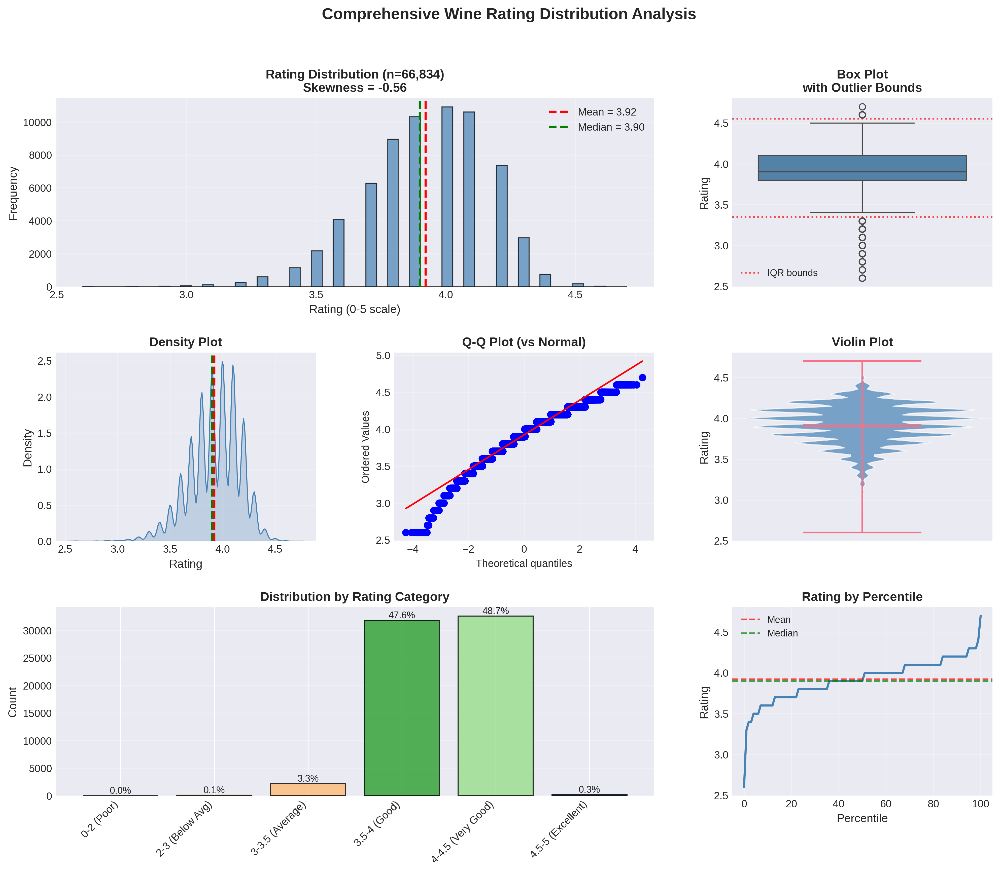
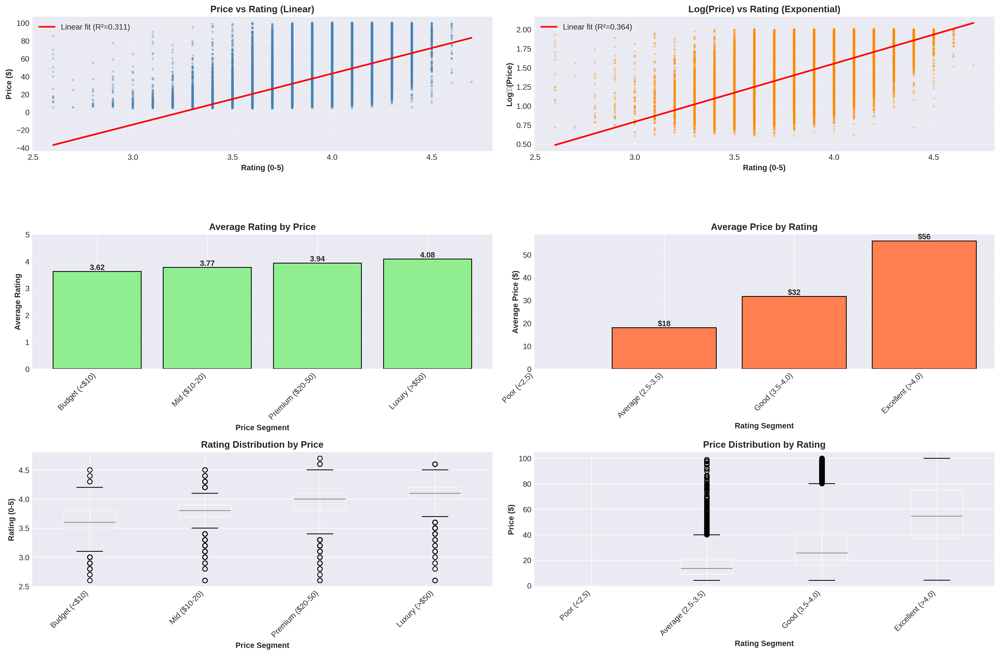
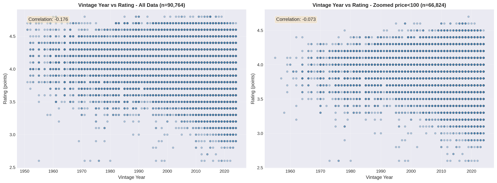
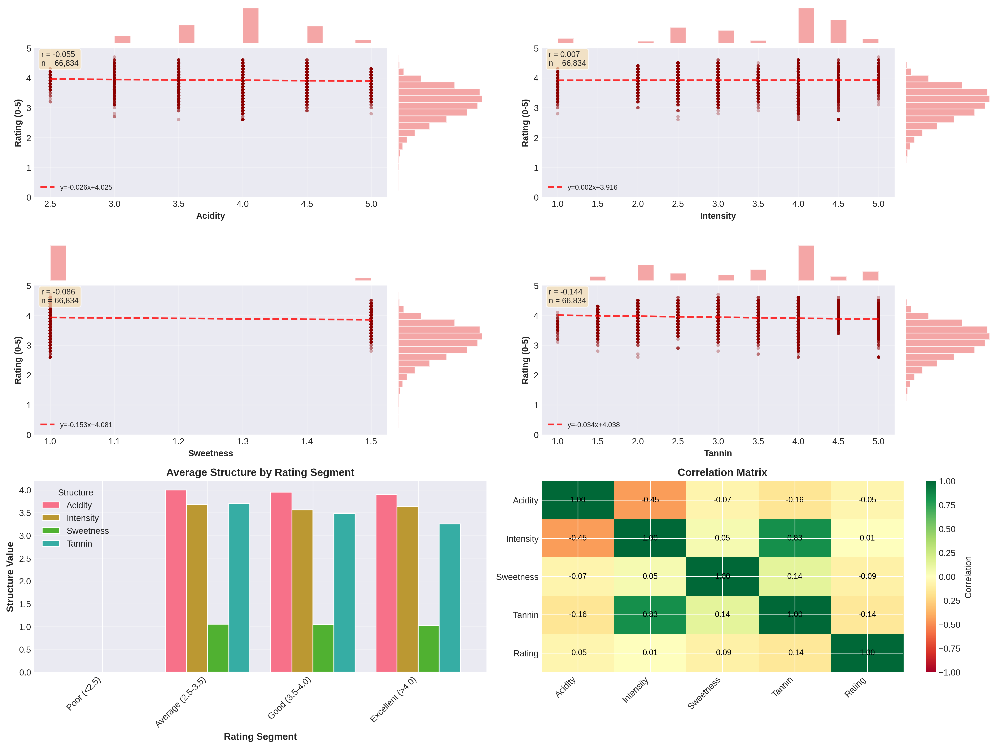
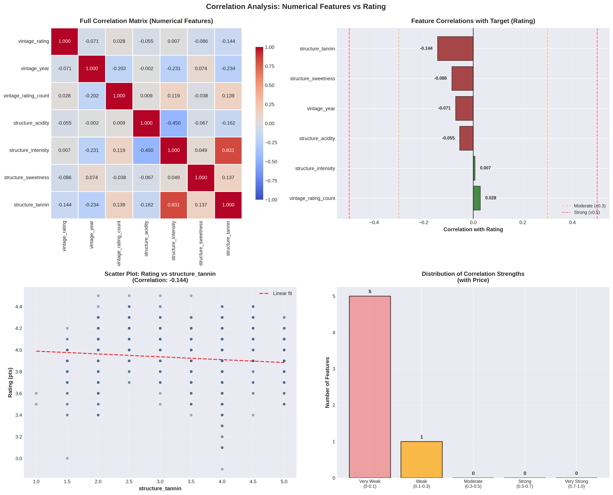
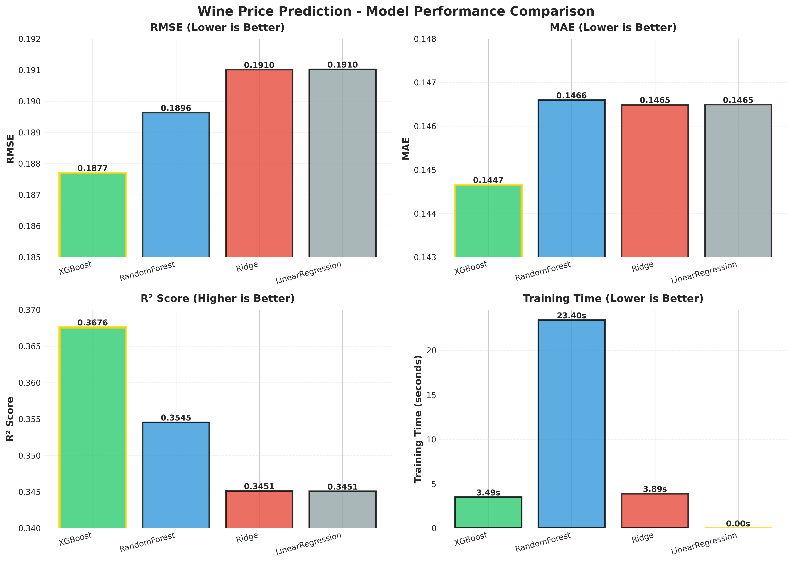
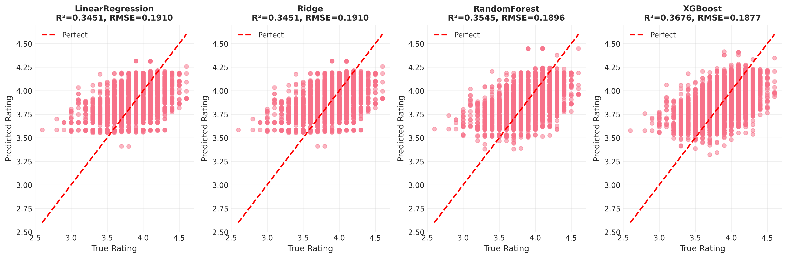
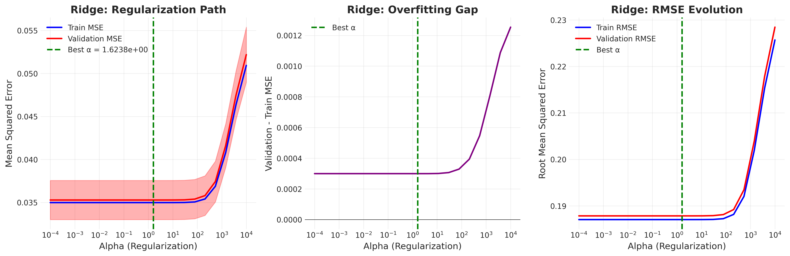

# Red French Wine Rating Prediction - ML Midterm Project

Midterm project for DataTalks.Club Machine Learning ZoomCamp '25


This is an end-to-end Machine Learning project that predicts ratings for red French wines using Vivino dataset features. The model is containerized with Docker and can be deployed as a web service.

---

## 🎯 Problem Statement

Wine quality and rating prediction is a practical business problem for:

The goal is to build a machine learning model that predicts wine ratings based on physicochemical features (alcohol content, acidity, grape variety, region, vintage year, etc.), enabling data-driven decision-making in wine selection and pricing.

Dataset: Red French wines from [Vivino](https://www.vivino.com) with 10000+ samples containing wine characteristics and user ratings.

---

## 📊 Goals

**Main Objective:** Build an end-to-end Machine Learning project:

- Load and explore wine dataset with exploratory data analysis (EDA)
- Clean and prepare data with advanced feature engineering
- Train and evaluate multiple regression models
- Deploy model as a containerized web service
  
  
  
  **Key Milestones:**

- ✅ Data collection and cleaning (Lot 1)
- ✅ Exploratory Data Analysis & visualization (Lot 2)
- ✅ Feature engineering with target encoding (Lot 3)
- ✅ Model training & hyperparameter tuning (Lot 3)
- ✅ REST API development (Lot 4)
- ✅ Docker containerization & deployment (Lot 5)
- ✅ HuggingFace Spaces deployment

---

## 🔢 Dataset

**Source:** Vivino French red wine dataset
**Size:** ~10000 samples with 14+ features

**Features:**

- **Wine Characteristics:** acidity, intensity, sweetness, tannic
- **Grape Varieties:** Pinot Noir, Cabernet Sauvignon, Merlot, etc.
- **Geographic:** region (Burgundy, Bordeaux, Rhône Valley, etc.)
- **Vintage:** year (2008-2020)
- **Price:** availability price in EUR (used for correlation analysis)
- **Target:** rating (user-aggregated score, typically 0-5 scale)

The dataset is a scrapped one from vivino, i had to remove few column that were not pertinent for the work and clean few missing value.


---

## 📊 Exploratory Data Analysis

Detailed analysis in [notebooks/Lot2_EDA_rating.ipynb](notebooks/Lot2_EDA_rating.ipynb)

I spent actually most of my time in this section, on one side it was interesting, but on the other it was a greate source of loosing time.  Here are few interesting ones in the following.

### Key Visualizations

**Rating Distribution Analysis**


I purposely limited the dataset to wines priced below 100 € to focus on affordable bottles.  
The resulting distribution is centered around 3.9. Interestingly, the key insight I’ll probably remember when choosing red wine is that for bottles under 15 €, the median rating is about 3.7.  
This means that when looking for wine for a party, that’s basically just the “average” level according to Vivino.

**Price vs Rating Relationship**

The price–rating analysis confirms a simple trend: you generally get what you pay for. More expensive wines tend to receive higher ratings, and the relationship appears consistent across all price segments. However the distribution analysis show that you can find excellent rated wine regardless of the price (just obviously less easily).

I considered including price as a feature in the model, but ultimately decided to exclude it. Since my goal is to predict the rating based **only** on the intrinsic characteristics of the wine, adding price would bias the model: two similar wines would systematically be pushed apart, with the more expensive one predicted as “better.” That would contradict the purpose of evaluating wine quality independently of its market price.





**Vintage Year Impact**


This result becomes interesting only when considering **all wines**, not just those under 100 €. It shows that expensive wines tend to have a stronger correlation with vintage year than affordable ones.  
After thinking about it, this makes sense: long-aging wines (“vins de garde”) typically increase in value as they mature, while affordable wines are a mix of young bottles and a few that were aged. This naturally weakens the vintage–price relationship in the lower price range.


**Wine Characteristics vs Rating**

I had high expectations for these features, but it turned out to be a disappointment: their correlation with rating is very low. I was hoping to identify clusters of characteristics that would correlate with rating or price, but that didn’t work either.  
The wine characteristics show weak predictive power and are distributed almost evenly across rating categories, with no clear patterns emerging.




**Feature Correlations**

I spent a lot of time on the feature analysis, trying to understand trends and meanings, and experimenting with feature engineering — none of which worked. In contrast, the global correlation analysis took much less time and led to essentially the same conclusion. Definitely a lesson in efficiency.

This part also highlights the biggest problem with the dataset: only a few features remain, and most of them have very low correlation with the rating.  
The best (and almost the only) meaningful feature is the region. The model can’t really distinguish between two Bordeaux wines, which is a bit disappointing — but since the goal here was mainly to practice, it’s acceptable.



---

## 🧪 Feature Engineering & Data Processing

**Target Encoding Strategy** (prevents data leakage):

- Regional features encoded with grouped split by wine ID (as same bottle of wine tend to have the same notes over the year)
- Categorical features (grapes, regions) transformed to statistical features:
  - Mean rating by category
  - Std deviation of ratings
  - Occurrence count
  - Other custom aggregations

**Key Preprocessing Steps:**

1. Data cleaning and outlier removal
2. Categorical encoding with target statistics
3. Feature scaling for regression models
4. Train/test split with grouped stratification

See [notebooks/Lot3_Modelling_te.ipynb](notebooks/Lot3_Modelling_te.ipynb) for detailed implementation.

---

## 🎛 Model Training & Evaluation

Multiple regression models trained with hyperparameter tuning:

### Models Evaluated

- **Linear Regression** - Baseline linear model
- **Ridge Regression** - L2 regularization variant
- **Random Forest** - Tree-based ensemble
- **XGBoost** - Gradient boosting with advanced features

### Performance Comparison



### Detailed Predictions Analysis



The results are quite disappointing. Even though the model seems to perform well with an RMSE of 0.2, it essentially relies only on the *region* as its discriminant factor. Since both the training and validation sets follow the same Gaussian distribution, the model ends up predicting something very close to the overall median, adjusted only by the region.  
It may look good on paper, but in practice two Haut-Médoc wines will receive almost identical predictions.


### Regularization Analysis (Ridge)



**Evaluation Metrics:**

- **RMSE (Root Mean Squared Error)** - Primary metric
- **MAE (Mean Absolute Error)** - Interpretable in rating points
- **R² Score** - Proportion of variance explained

All models were trained using **GridSearchCV** or **RandomizedSearchCV** to select optimal hyperparameters. However, this graph illustrates that **regularization has little effect**, since the target can be predicted almost entirely from the limited set of remaining features that are correlated with it.


---

## 📁 Project Structure

```
Midterm/
├── README.md                                          ← You are here
├── requirements.txt                                   ← Python dependencies
├── Dockerfile                                         ← Container image
├── pyproject.toml                                     ← Project config
│
├── data/
│   └── france_wines_*.csv                            ← Raw datasets
│
├── notebooks/                                         ← Jupyter development
│   ├── Lot1_Data_analysis_and_cleaning.ipynb        ← Data exploration & cleaning
│   ├── Lot2_EDA_rating.ipynb                        ← Detailed EDA & visualizations
│   ├── Lot3_Modelling_te.ipynb                      ← Model training & evaluation
│   ├── Lot4_websevice_test.ipynb                    ← API testing notebook
│   ├── Lot5_docker_summary.ipynb                    ← Docker deployment guide
│   ├── target_encoder.py                            ← Custom encoding class
│   ├── models/
│   │   ├── trained/                                 ← Trained model pickles
│   │   │   ├── LinearRegression_te.pkl
│   │   │   ├── Ridge_te.pkl
│   │   │   ├── RandomForest_te.pkl
│   │   │   ├── XGBoost_te.pkl
│   │   │   └── best_model_te.pkl
│   │   └── encoders/
│   │       └── target_encoder.pkl                   ← Fitted encoder
│   └── results/
│       └── plots/                                   ← Visualizations
│           ├── rating_analysis.png
│           ├── price_vs_rating.png
│           ├── correlation.png
│           ├── year_vs_rating.png
│           ├── region_grapes_vs_rating.png
│           ├── charach_vs_rating.png
│           ├── model_comparison_simple.png
│           ├── model_comparison_predictions.png
│           └── ridge_regularization_analysis.png
│
├── refactored_final_scripts/                        ← Production-ready scripts
│   ├── 1_train.py                                   ← Model training pipeline
│   ├── 2_predict.py                                 ← Batch prediction
│   ├── 3_serve.py                                   ← FastAPI web service
│   ├── 4_test_server_predict.py                     ← Integration tests
│   ├── target_encoder.py                            ← Encoding utility
│   ├── models/                                      ← Models for serving
│   └── Dockerfile                                   ← Containerization
│
└── HF_deployment/                                   ← HuggingFace deployment
    └── README.md                                    ← HF-specific configuration
```

---

## 🚀 Quick Start

### Prerequisites

- Python 3.11+
- Docker & Docker Compose (for containerized deployment)
- Git

### Local Setup

1. **Clone repository**
   
   ```bash
   git clone https://github.com/Nuopel/machine-learning-zoomcamp-nuopel/
   cd machine-learning-zoomcamp-nuopel/Projects/Midterm
   ```

2. **Create virtual environment**
   
   ```bash
   python -m venv venv
   source venv/bin/activate  # On Windows: venv\Scripts\activate
   ```

3. **Install dependencies**
   
   ```bash
   pip install -r requirements.txt
   ```

---

## 📚 Notebooks Guide

### Development Notebooks (in `notebooks/`)

| Notebook                                  | Purpose                                                              |
| ----------------------------------------- | -------------------------------------------------------------------- |
| **Lot1_Data_analysis_and_cleaning.ipynb** | Raw data exploration, cleaning, initial statistics                   |
| **Lot2_EDA_rating.ipynb**                 | Comprehensive EDA with visualizations and correlation analysis       |
| **Lot3_Modelling_te.ipynb**               | Feature engineering with target encoding, model training, evaluation |
| **Lot4_websevice_test.ipynb**             | Testing the FastAPI web service endpoints                            |
| **Lot5_docker_summary.ipynb**             | Docker containerization and deployment guide                         |

Run notebooks interactively:

```bash
jupyter notebook notebooks/
```

---

## 🔧 Production Scripts

### Overview

Refactored scripts in `refactored_final_scripts/` for production use:

### 1. **1_train.py** - Model Training Pipeline

Trains all models with advanced target encoding:

```bash
python refactored_final_scripts/1_train.py
```

**Output:**

- Trained models saved to `models/trained/`
- Target encoder saved to `models/encoders/`
- Performance metrics logged

### 2. **2_predict.py** - Prediction

Make predictions on new data with loading the model :refactored_final_scripts/2_predict.py

### 3. **3_serve.py** - Run a server with a model

Start the prediction API server:

```bash
python refactored_final_scripts/3_serve.py
```

**API Endpoints:**

- `GET /health` - Server health check
- `POST /predict` - Single wine rating prediction
- `POST /predict-batch` - Batch predictions

### 4. **4_test_server_predict.py** - Integration Tests

Test the running API:

```bash
python refactored_final_scripts/4_test_server_predict.py
```

---

## 🐳 Docker Deployment

### Build & Run Locally

1. **Build Docker image**
   
   ```bash
   docker build -f refactored_final_scripts/Dockerfile -t wine-rating-api:latest .
   ```

2. **Run container**
   
   ```bash
   docker run -p 7860:7860 wine-rating-api:latest
   ```

3. **Test the API**
   
   Run 4_test_server_predict.py
   
   ---

## ☁️ Cloud Deployment

### HuggingFace Spaces

The model is deployed on HuggingFace Spaces as a live, public API:

**API URL:** `https://nuopel-wine-rating-api.hf.space/`

**Live Testing:**

It It can be tested by refactored_final_scripts/4_test_server_predict.py by setting the above url 

---

**Deployment Steps:** See [HF_deployment/README.md](HF_deployment/README.md)

**Key Configuration:**

- Docker SDK on HuggingFace Spaces
- Port: 7860 (configured in Dockerfile)
- Auto-scaling enabled
- Persistent model storage

---

---

## 🛠️ Tech Stack

- **Data Processing:** Pandas, NumPy, Scikit-learn
- **Visualization:** Matplotlib, Seaborn
- **ML Models:** Scikit-learn, XGBoost
- **Feature Engineering:** Custom target encoding
- **API:** FastAPI with Pydantic
- **Containerization:** Docker
- **Deployment:** HuggingFace Spaces

---

## 📝 Development Notes

### Key Design Decisions

1. **Target Encoding with Grouped Split:**
   
   - Prevents data leakage by grouping wines (all vintages together)
   - Enables use of categorical features (region, grape) as predictive signals

2. **Model Selection:**
   
   - Linear/Ridge for interpretability
   - Tree-based models for non-linear relationships
   - XGBoost for potential performance gain

3. **Deployment Strategy:**
   
   - Docker for reproducibility
   - FastAPI for high-performance async API
   - HuggingFace Spaces for free, accessible cloud hosting

---

## 🔍 Reproducing Results

To retrain the entire model from scratch:

```bash
# 1. Install dependencies
pip install -r requirements.txt

# 2. Run training pipeline
python refactored_final_scripts/1_train.py

# 3. Start API server
python refactored_final_scripts/3_serve.py

# 4. Test predictions
python refactored_final_scripts/4_test_server_predict.py
```

All data and trained models will be saved to respective directories.

---

## ---

## 📄 License

This project is part of the Machine Learning ZoomCamp course.

---

**Project Timeline:** November 2025
**Status:** Complete
